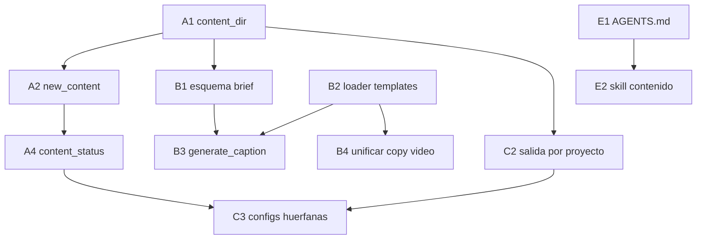

# Plan de acción — agente conversacional de contenido

Estado objetivo: el usuario dice *"escribí algo sobre X"* y el agente
investiga, propone, itera y entrega piezas listas, sin que el usuario
tenga que conocer rutas, formatos ni comandos.

El comportamiento está definido en `docs/agent-mode.md`. Este documento
lista **qué falta construir** para sostenerlo.

---

## 1. Diagnóstico

### Lo que ya existe

| Capacidad | Dónde | Estado |
|---|---|---|
| Selección de tenant + aislamiento | `src/noticia_carrusel/tenant.py` | Completo |
| Resolución de assets tenant → compartido | `TenantContext.resolve_asset()` | Completo |
| Protección de path traversal | `TenantContext.resolve_inside()` | Completo |
| Render de placas y carruseles | `scripts/generate_images.py` | Completo |
| Render de video | `build.py` | Completo |
| Generación de imagen por IA | `providers/openrouter_image_provider.py` | Completo |
| Generación de texto | `scripts/promptgate_client.py` → `chat()` | Parcial |
| Publicación con namespace aislado | `scripts/publish_final.py` | Completo |
| Guías de diseño visual | `templates/prompts/` | Completo |
| Guías de texto editorial | `templates/posts/` | Completo |

### Lo que falta

| # | Hueco | Impacto |
|---|---|---|
| G1 | No hay carpeta de proyecto de contenido (`content/`) | El brief y los borradores no tienen dónde vivir |
| G2 | `chat()` solo se usa para el copy de videos con JSON de top | No hay generación de caption para imágenes |
| G3 | `templates/posts/` no lo consume ningún script | Los templates dependen de que el agente los lea a mano |
| G4 | No hay flag de calidad en el CLI de imágenes | Prototipo y final no se distinguen por comando |
| G5 | No hay descarga asistida de logos | Cada logo nuevo es trabajo manual |
| G6 | `resolved_output_dir()` fuerza salida a `tenant.output_dir` | Los PNG de un tema quedan lejos de su brief |
| G7 | No hay comando para listar tenants | El agente no puede enumerar opciones |
| G8 | No hay esquema validable del brief | La investigación queda en prosa libre |
| G9 | No hay inventario de contenido en curso | No se sabe qué temas están a medio hacer |
| G10 | `AGENTS.md` no describe el modo agente | El comportamiento no se activa solo |

---

## 2. Principios del plan

1. **El agente es el orquestador.** No se construye un motor de diálogo
   en Python. Los scripts son herramientas deterministas; la
   conversación la lleva el agente.
2. **Nada rompe lo existente.** Todo lo nuevo es aditivo. Los comandos
   actuales siguen funcionando igual.
3. **Todo path pasa por `TenantContext`.** Ninguna función nueva
   resuelve rutas por su cuenta.
4. **Sin dependencias nuevas** salvo justificación explícita.

---

## 3. Fases

### Fase A — Fundación del proyecto de contenido

Resuelve G1, G7, G9.

#### A1. `TenantContext.content_dir`

- **Target**: `src/noticia_carrusel/tenant.py`
- **Change**: agregar property `content_dir` → `self.root / "content"` y
  método `content_path(slug)` que valide el slug con
  `^\d{4}-\d{2}-\d{2}_[a-z0-9][a-z0-9-]*$` y resuelva vía
  `resolve_inside(self.content_dir, slug)`.
- **Acceptance**: `content_path("2026-08-28_nvidia-hf")` devuelve la ruta
  dentro del tenant; `content_path("../fuga")` lanza `ValueError`.

#### A2. `scripts/new_content.py`

- **Target**: archivo nuevo.
- **Change**: CLI `--tenant`, `--slug`, `--tema`. Crea
  `content/<fecha>_<slug>/` con `brief.md`, `caption.md`, `assets/`.
  `brief.md` se crea con el esqueleto de secciones de
  `docs/agent-mode.md` §3. Si la carpeta existe, falla salvo `--force`.
- **Acceptance**: ejecutar dos veces sin `--force` devuelve exit 1 sin
  tocar los archivos existentes.

#### A3. Listado de tenants

- **Target**: `src/noticia_carrusel/tenant.py`, `scripts/generate_images.py`, `build.py`
- **Change**: función `list_tenants()` que devuelve los ids válidos de
  `tenants/`; flag `--list-tenants` en ambos CLI.
- **Acceptance**: `python build.py --list-tenants` imprime `agente32`.

#### A4. Inventario de contenido

- **Target**: `scripts/content_status.py` (nuevo)
- **Change**: recorre `content/`, y para cada proyecto reporta si tiene
  `brief.md` con fuentes, `caption.md` no vacío, config asociada en
  `configs/images/` y renders en `output/`.
- **Acceptance**: sobre un tenant sin `content/` imprime "sin proyectos"
  y sale 0.

---

### Fase B — Generación de texto con templates

Resuelve G2, G3, G8. Depende de A1.

#### B1. Esquema del brief

- **Target**: `src/noticia_carrusel/brief.py` (nuevo)
- **Change**: modelos Pydantic `Fuente(url, medio, fecha, tipo)` y
  `Brief(tema, estado, hechos, fuentes, sin_confirmar, contradicciones,
  porque_importa)`. `estado` es
  `Literal["confirmado","rumor","en_curso","desmentido"]`. Validador:
  `estado="confirmado"` exige ≥ 2 fuentes con `tipo="primaria"`.
- **Acceptance**: un brief marcado confirmado con una sola fuente
  secundaria falla la validación con mensaje claro.

#### B2. Carga de templates de posts

- **Target**: `src/noticia_carrusel/post_templates.py` (nuevo)
- **Change**: `load_post_template(name)` que lee de `templates/posts/`,
  valida que el nombre esté en la lista conocida y devuelve el texto.
  Sin `..` ni rutas absolutas.
- **Acceptance**: `load_post_template("post_noticia")` devuelve el
  contenido; `load_post_template("../../.env")` lanza `ValueError`.

#### B3. `scripts/generate_caption.py`

- **Target**: archivo nuevo.
- **Change**: CLI `--tenant`, `--slug`, `--template`, `--red`
  (`instagram` por defecto). Lee `brief.md` del proyecto, carga el
  template, arma el prompt para PromptGate con el bloque de datos
  delimitado por `BEGIN_DATA` / `END_DATA` — el mismo patrón
  anti-inyección que ya usa `build.py::generate_post_summary` — y
  escribe `caption.md`.
- **Acceptance**: con un `brief.md` válido produce un caption ≤ 2200
  caracteres que incluye el handle del tenant. Sin `PROMPTGATE_MODEL`
  falla con mensaje explícito, sin escribir nada.

#### B4. Unificar el copy de video

- **Target**: `build.py::generate_post_summary`
- **Change**: reemplazar el system prompt embebido por
  `load_post_template("post_lista_top")`.
- **Acceptance**: el copy de `lostops` se sigue generando y respeta la
  estructura del template.

---

### Fase C — Prototipo y calidad

Resuelve G4, G6. Depende de A1.

#### C1. Flag de calidad en imágenes

- **Target**: `scripts/generate_images.py`, `src/noticia_carrusel/generator.py`
- **Change**: `--quality {draft,low,medium,high}`, default `draft`.
  Sobrescribe `image_generation.model` con el alias correspondiente en
  tiempo de ejecución, sin tocar el YAML.
- **Acceptance**: con `--quality draft` el proveedor recibe el primer
  modelo de `OPENROUTER_IMAGE_DRAFT_MODELS`; con `--quality high`,
  `OPENROUTER_IMAGE_QUALITY_HIGH_MODEL`. El YAML queda intacto.

#### C2. Salida vinculada al proyecto

- **Target**: `src/noticia_carrusel/models.py`, `tenant.py`
- **Change**: campo opcional `content_slug` en `AppConfig`. Si está
  presente, `resolved_output_dir()` resuelve a
  `content/<slug>/renders/`; si no, mantiene el comportamiento actual
  contra `tenant.output_dir`.
- **Acceptance**: las configs existentes sin `content_slug` siguen
  escribiendo exactamente en las mismas rutas de hoy.

#### C3. Índice de contactos entre config y proyecto

- **Target**: `scripts/content_status.py`
- **Change**: cruzar `content_slug` de cada YAML con las carpetas de
  `content/`, y marcar configs huérfanas.
- **Acceptance**: una config con `content_slug` inexistente aparece
  listada como huérfana.

---

### Fase D — Assets asistidos

Resuelve G5.

#### D1. `scripts/fetch_logo.py`

- **Target**: archivo nuevo.
- **Change**: CLI `--tenant`, `--slug`, `--url`. Descarga el SVG o PNG,
  valida `Content-Type`, aplica límite de tamaño (2 MiB, igual que el
  descargador de logos de la escena `lostops`), guarda en
  `tenants/<id>/assets/logos/<slug>/` y escribe un `README.md` con URL
  de origen, fecha y licencia declarada.
- **Acceptance**: una URL que devuelve HTML en vez de imagen falla sin
  dejar archivos parciales. Un archivo de más de 2 MiB se rechaza.

#### D2. Sanitización para Manim

- **Target**: `scripts/fetch_logo.py`
- **Change**: flag `--for-manim` que aplica el procedimiento de
  `skills/global.md` §3: `currentColor` y `url(#…)` reemplazados,
  `stroke:none` forzado, salida como `<slug>_paths.svg`.
- **Acceptance**: el SVG resultante se importa en una escena de Manim
  sin halos de stroke.

> Nota: el pipeline de imágenes usa cairosvg y **sí** soporta `<text>`.
> La conversión a curvas solo hace falta para Manim.

---

### Fase E — Activación del comportamiento

Resuelve G10. Depende de todas las anteriores para los comandos que
menciona, pero el texto se puede escribir antes.

#### E1. Sección de modo agente en `AGENTS.md`

- **Target**: `AGENTS.md`
- **Change**: bloque con arranque de sesión, router de intención,
  pipeline de noticia, reglas de interacción y gate de publicación.
  Debe declarar la precedencia frente a la regla ⚡ de render express.
- **Acceptance**: un agente que solo lee `AGENTS.md` sabe que ante
  "escribí algo sobre X" debe investigar antes de escribir.

#### E2. Skill de contenido

- **Target**: `skills/contenido.md` (nuevo)
- **Change**: skill de carga automática para tareas de contenido de
  redes, equivalente a `skills/global.md` pero para imágenes y captions.
- **Acceptance**: referenciada desde `AGENTS.md` en la regla de carga
  obligatoria de skills.

#### E3. Sincronización entre agentes — verificado, no aplica

- **Target**: `AGENTS.md`, `CLAUDE.md`, `opencode.json` si aplica
- **Hallazgo**: el repo no tiene `CLAUDE.md` ni `opencode.json` propios.
  `AGENTS.md` es la única fuente y Claude Code, Codex y OpenCode la leen
  por igual como estándar cross-agent. No hay tres archivos que
  desincronizar: hay una fuente y tres consumidores ya alineados.
- **Decisión**: no crear `CLAUDE.md`/`opencode.json` redundantes. Duplicar
  el contenido de `AGENTS.md` en archivos paralelos introduce una segunda
  fuente de verdad sin necesidad — el riesgo real sería divergencia
  futura si alguien edita uno y no el otro, no falta de sincronización
  actual.
- **Acceptance**: cumplido por construcción (una fuente, tres consumidores).
  Si en el futuro se agrega `CLAUDE.md` u `opencode.json` a este repo,
  reflejar ahí el modo agente y señalar la deriva.

---

## 4. Orden de ejecución



`A3`, `C1`, `D1` y `D2` no tienen dependencias y pueden ir en cualquier
momento.

**Ruta crítica**: A1 → B1/B2 → B3. Con eso el agente ya puede investigar,
guardar el brief y producir un caption con template.

---

## 5. Prioridad

| Prioridad | Tareas | Razón |
|---|---|---|
| P0 | E1, A1, A2 | Sin esto el comportamiento no se activa |
| P1 | B1, B2, B3 | Núcleo de "desarrollar un tema" |
| P2 | C1, D1 | Calidad de iteración y assets |
| P3 | A3, A4, B4, C2, C3, D2, E2, E3 | Ergonomía y consistencia |

---

## 6. Verificación

Cada fase cierra con smoke test real, no con test unitario de plumbing:

| Fase | Smoke test |
|---|---|
| A | `new_content.py` crea la carpeta; `content_status.py` la lista |
| B | Brief de ejemplo → caption generado, ≤ 2200 caracteres, con handle |
| C | Misma config con `--quality draft` y `high` usa modelos distintos |
| D | Logo real descargado, con README de origen y tamaño validado |
| E | Pedido "escribí algo sobre X" dispara investigación, no redacción |

Al cerrar todas las fases, prueba de extremo a extremo con el caso del
enunciado:

```
"Quiero que escribas algo sobre la compra de HuggingFace por Nvidia"
```

Resultado esperado:

1. El agente investiga y muestra el brief con estado por hecho.
2. Espera validación del usuario sobre los hechos.
3. Propone caption con `post_noticia.md`, marcando lo no confirmado.
4. Pregunta formato, con recomendación.
5. Genera prototipo en `draft` y reporta paths.
6. Itera.
7. Genera final en calidad alta.
8. No publica hasta aprobación explícita.

---

## 7. Riesgos

| Riesgo | Mitigación |
|---|---|
| El modelo inventa datos al redactar | Bloque `BEGIN_DATA`/`END_DATA`, prohibición explícita en el system prompt, y validación del brief antes de redactar |
| Inyección de prompt desde contenido web | El contenido investigado entra como datos delimitados, nunca como instrucciones |
| Fuga de assets entre tenants | Todo path por `TenantContext`; ya cubierto y verificado |
| Publicación accidental | Gate de aprobación explícita; `publish_final.py` nunca se invoca desde `build.py` |
| Descarga de logos con licencia incompatible | README de origen obligatorio con licencia declarada |
| Rotura de configs existentes al agregar `content_slug` | Campo opcional; comportamiento por defecto sin cambios |
