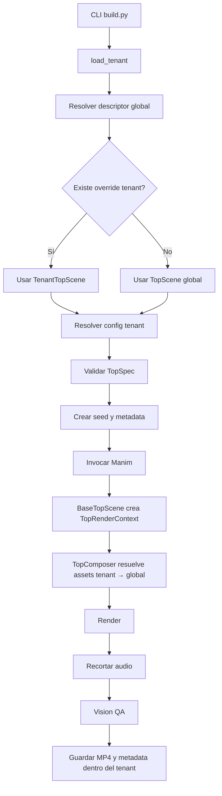

# Refactor del generador global de tops y arquitectura de assets

## Estado del documento

- Tipo: diseño técnico y plan de migración.
- Alcance: generadores de video Manim reutilizables, empezando por `top`/`losmas`/`lostops`.
- Tenant usado para validar el análisis actual: `agente32`.
- Este documento no implementa la migración. Define el corte limpio que debe aplicarse.
- Este diseño complementa y corrige `docs/multi-tenant-folder-design.md`: el código de generadores reutilizables ya no pertenece a `tenants/<id>/videos/`.

## 1. Decisión ejecutiva

El archivo actual:

```text
tenants/agente32/videos/lostops/scene.py
```

mezcla cinco responsabilidades:

1. carga y selección del JSON;
2. resolución de assets;
3. branding de Agente E32;
4. composición y animación Manim;
5. selección de fondo y temporización.

La mayor parte de ese código no es específica de Agente E32. Debe convertirse en un generador global llamado `top`, disponible para todos los tenants.

La arquitectura objetivo separa cuatro capas:

1. **Código común**: modelos, carga, composición y escena base.
2. **Entrypoint global**: archivo ejecutable por Manim y descubrible por `build.py`.
3. **Datos y marca del tenant**: JSON, manifest, themes, assets y outputs.
4. **Override opcional del tenant**: una clase pequeña que hereda de la escena base y reemplaza componentes explícitos. Solo existe cuando hay una necesidad real.

La regla de assets será única en todo el repositorio:

```text
asset explícito o lógico
    → buscar primero en tenants/<tenant>/assets/
    → si no existe, buscar en assets/ global
    → si no existe, fallar
```

Para pools, como fondos aleatorios, se construirá un catálogo combinado. Si existe el mismo path lógico en ambas capas, gana el tenant.

## 2. Conclusiones del relevamiento actual

### 2.1 Ya existe una carpeta global de assets

No hay que inventar un concepto nuevo. El repositorio ya contiene:

```text
assets/
├── fonts/
└── logos/
    ├── anthropic/
    ├── deepseek/
    ├── google/
    └── openai/
```

También existe la carpeta de assets del tenant:

```text
tenants/agente32/assets/
├── backgrounds/
├── images/
├── logos/
└── sounds/
```

El problema no es la ausencia de las dos capas. El problema es que no todos los consumidores usan el mismo resolver.

### 2.2 `TenantContext.resolve_asset()` ya implementa la precedencia correcta

`src/noticia_carrusel/tenant.py` ya ofrece:

```python
TenantContext.resolve_asset(relative)
```

Su comportamiento actual es:

1. busca `tenants/<id>/assets/<relative>`;
2. si no existe, busca `assets/<relative>`;
3. si tampoco existe, lanza `FileNotFoundError` mostrando ambas rutas.

Este es el contrato que debe reutilizarse. No debe crearse un segundo resolver exclusivo para videos.

### 2.3 El generador `lostops` evita ese resolver

`tenants/agente32/videos/lostops/scene.py` calcula rutas mediante:

```python
Path(__file__).parents[2] / "assets"
Path(__file__).parent / "json"
```

Consecuencias:

- el código depende de la profundidad física de la carpeta;
- no puede moverse fuera del tenant sin romper rutas;
- logos, sonidos y fondos globales no usan `TenantContext.resolve_asset()`;
- el pool de fondos solo enumera `tenants/agente32/assets/backgrounds/`;
- el código supone que siempre representa a Agente E32;
- las pruebas requieren replicar la estructura de directorios real.

### 2.4 El branding está hardcodeado

La escena actual contiene decisiones propias del tenant:

- `theme = AGENTE32`;
- footer fijo con `agente32` y `fabian128k`;
- rutas concretas de esos logos;
- handle y composición visual asumidos por el código;
- colores y textos secundarios definidos en el módulo.

Estas decisiones deben provenir del manifest y de un estilo inyectado, no del generador común.

### 2.5 Hay efectos secundarios durante el import

El módulo actual carga el JSON y elige el fondo en variables globales:

```python
TOP = _cargar_top()
MODELOS = _normalizar(TOP)
FONDO_PATH = _resolver_fondo(TOP)
```

Esto dificulta:

- importar el módulo en tests sin filesystem real;
- seleccionar otro config en la misma ejecución;
- reproducir una elección aleatoria;
- saber qué dependencia provocó un error;
- crear más de una instancia del generador con parámetros distintos.

La carga debe ocurrir al crear el contexto de render, no al importar el módulo.

El selector actual `TOP_JSON` también debe retirarse en el corte limpio. El único contrato interno nuevo será `VIDEO_CONFIG`, generado por el builder y revalidado por la escena.

### 2.6 `build.py` solo descubre escenas dentro del tenant

Actualmente `configure_tenant()` fija:

```python
VIDEOS_DIR = tenant.videos_dir
```

Luego `discover_scenes()` solo recorre esa carpeta. Por eso un generador global no puede existir todavía como recurso ejecutable de primera clase.

Además:

- el descubrimiento depende de una expresión regular sobre clases Python;
- `_post_source()` busca JSON junto al archivo de escena;
- el output se deriva de la carpeta física de la escena;
- no existe `--config` para elegir explícitamente un top;
- una escena global no puede inferir correctamente el config del tenant desde `__file__`.

### 2.7 El pool de backgrounds compartido tampoco está completo

`src/noticia_carrusel/backgrounds.py` solo enumera el directorio del tenant. Para un asset individual, `resolve_asset()` sí hace fallback global; para una colección de assets, no existe todavía un contrato equivalente.

Eso debe resolverse una sola vez y reutilizarse en posts, carruseles y videos.

### 2.8 La documentación vigente contiene una decisión que debe cambiar

`docs/multi-tenant-folder-design.md` indica actualmente que escenas y JSON de videos viven dentro del tenant. La nueva decisión es más precisa:

- **instancias de contenido y configs**: tenant;
- **generadores reutilizables**: globales;
- **escenas completamente únicas**: tenant;
- **overrides de un generador global**: tenant, opcionales y pequeños.

También deben actualizarse `AGENTS.md`, `README.md`, `skills/global.md` y `skills/los_mas_usados.md` al implementar el cambio. Como el proyecto usa ChatGPT Codex, Claude Code y OpenCode, la instrucción equivalente debe quedar sincronizada en las configuraciones locales de los tres agentes.

## 3. Objetivos

### 3.1 Objetivos funcionales

1. Cualquier tenant puede renderizar un top usando el mismo código global.
2. Cada tenant mantiene sus propios datos, branding, assets y outputs.
3. Un tenant puede personalizar el generador sin copiarlo completo.
4. Los assets del tenant tienen prioridad sobre los globales.
5. Los assets globales pueden reutilizarse cuando el tenant no define uno propio.
6. Un fondo explícito siempre tiene prioridad sobre un pool.
7. Si no hay fondo explícito, el generador puede elegir uno del catálogo combinado.
8. La selección aleatoria queda registrada y puede reproducirse con un seed.
9. Ningún output puede escribirse fuera del tenant activo.
10. El comando puede seleccionar un config concreto o usar el más reciente.

### 3.2 Objetivos de diseño

1. El dominio `top` no depende de `agente32`.
2. No usar `Path(__file__).parents[...]` para resolver assets o configs.
3. No ejecutar I/O ni aleatoriedad al importar módulos.
4. Usar composición para variaciones de layout, branding, background y animación.
5. Usar una única herencia poco profunda en el límite de Manim.
6. Mantener contratos explícitos y validarlos con Pydantic.
7. Evitar registries mágicos, imports arbitrarios y jerarquías profundas.
8. Reutilizar `TenantContext` y `src/noticia_carrusel/backgrounds.py`.
9. Hacer un corte limpio: migrar todos los callers y eliminar el código viejo.

## 4. No objetivos

No incluir en esta migración:

- base de datos de tenants;
- servicio web o API;
- editor visual;
- descarga automática de assets durante un render;
- symlinks entre carpetas;
- copia automática de assets globales a cada tenant;
- sistema de plugins instalables desde terceros;
- ejecución de código tenant no versionado;
- jerarquías de clases con más de un nivel tenant sobre la escena base;
- compatibilidad permanente con `tenants/<id>/videos/lostops/json/`.

## 5. Invariantes arquitectónicas

### 5.1 Propiedad de cada tipo de archivo

| Tipo | Propietario | Ubicación |
|---|---|---|
| Algoritmo del top | global | `src/noticia_carrusel/video_generators/top/` |
| Entrypoint Manim del top | global | `generators/videos/top/` |
| Descriptor del generador | global | `generators/videos/top/generator.yaml` |
| Datos de un top | tenant | `tenants/<id>/configs/videos/top/` |
| Theme seleccionado | tenant manifest | `tenants/<id>/tenant.yaml` |
| Assets reutilizables | global | `assets/` |
| Assets de marca o exclusivos | tenant | `tenants/<id>/assets/` |
| Override Python opcional | tenant | `tenants/<id>/overrides/videos/top/` |
| Media y QA | tenant | `tenants/<id>/media/` |
| Publicación | externa y explícita | solo mediante `publish_final.py` |

### 5.2 Lectura y escritura

- Lecturas: tenant primero, global después.
- Escrituras: solo dentro del tenant.
- Assets globales: solo lectura durante generación.
- Un tenant nunca puede leer assets privados de otro tenant.
- Paths de config: relativos, sin `..`, validados con `resolve()`.
- Paths de override: confinados al tenant activo.

### 5.3 Aleatoriedad

“Elegir al azar” no debe significar “imposible de reproducir”.

Regla:

1. `build.py` genera un `RENDER_SEED` si el usuario no lo proporciona.
2. El seed se imprime y se guarda en metadata de la corrida.
3. El generador crea `random.Random(seed)` una vez.
4. La selección de fondo usa esa instancia.
5. Todos los frames del mismo video usan el mismo fondo.
6. Repetir el mismo config con el mismo seed produce la misma selección.
7. Un nuevo render sin seed recibe otro seed y puede elegir otro fondo.

## 6. Árbol objetivo

```text
redes2/
├── assets/                                  # globales, solo lectura
│   ├── backgrounds/
│   ├── fonts/
│   ├── logos/
│   ├── images/
│   └── sounds/
├── generators/
│   └── videos/
│       └── top/
│           ├── generator.yaml               # id, aliases, entrypoint, clase
│           └── scene.py                     # entrypoint Manim mínimo
├── src/noticia_carrusel/
│   ├── tenant.py
│   ├── backgrounds.py
│   ├── video_generators/
│   │   ├── registry.py
│   │   └── top/
│   │       ├── models.py                    # TopSpec, TopItem, validaciones
│   │       ├── loader.py                    # carga de config sin globals
│   │       ├── style.py                     # tokens visuales inmutables
│   │       ├── context.py                   # TopRenderContext
│   │       ├── composer.py                  # composición y animación
│   │       └── scene.py                     # BaseTopScene
│   └── ...
├── tenants/
│   └── agente32/
│       ├── tenant.yaml
│       ├── assets/                          # exclusivos o de marca
│       │   ├── backgrounds/
│       │   ├── logos/
│       │   ├── images/
│       │   └── sounds/
│       ├── configs/
│       │   └── videos/
│       │       └── top/
│       │           ├── 2026-08-23_modelos-semana.json
│       │           └── 2026-09-05_top-lomas-prototipo.json
│       ├── overrides/
│       │   └── videos/
│       │       └── top/
│       │           └── scene.py             # solo si realmente se personaliza
│       └── media/
│           └── videos/
│               └── top/
│                   └── <content-slug>/
│                       └── 1920p30/
│                           ├── TopScene.mp4
│                           ├── render_metadata.json
│                           └── vision_review.json
└── tests/
    ├── test_asset_resolution.py
    ├── test_video_generator_registry.py
    ├── test_top_models.py
    ├── test_top_backgrounds.py
    └── test_top_builder.py
```

## 7. Contratos propuestos

### 7.1 Descriptor del generador

Archivo global:

```yaml
# generators/videos/top/generator.yaml
id: top
aliases:
  - losmas
  - lostops
  - ranking
engine: manim
entrypoint: scene.py
scene_class: TopScene
config_subdir: top
```

Reglas:

- `id` único y validado como slug.
- `aliases` únicos entre generadores.
- `entrypoint` relativo al directorio del descriptor.
- `scene_class` identificador Python válido.
- `config_subdir` relativo a `tenant.configs_dir / "videos"`.
- El descriptor no acepta comandos shell.
- El descriptor no acepta paths absolutos.

Este manifest reemplaza el descubrimiento accidental por regex para generadores comunes. Las escenas únicas del tenant pueden conservar descubrimiento separado mientras existan.

### 7.2 Config genérico del top

El contrato nuevo no debe conservar nombres específicos de modelos de IA como `modelos` o `provider`. Un top puede ordenar herramientas, restaurantes, lenguajes, productos o cualquier otra entidad.

Usar un esquema neutral y validarlo con Pydantic:

```json
{
  "schema_version": 1,
  "title": ["TOP MODELOS", "DE LA SEMANA"],
  "subtitle": "Semana del 1 al 7 de septiembre",
  "audio": {
    "asset": "sounds/intros/SunsetDrift.mp3",
    "gain_db": -4
  },
  "background_image_path": null,
  "final_hold_seconds": 5.0,
  "items": [
    {
      "name": "Elemento",
      "visual_asset": "logos/openai/openai_paths.svg",
      "secondary_text": "Categoría o proveedor",
      "metric": {
        "label": "Tokens",
        "value": "890M"
      },
      "comment": ["Línea 1", "Línea 2"],
      "specs": [
        {"label": "Estado", "value": "Confirmado"}
      ]
    }
  ]
}
```

Decisiones:

- `background_image_path: null` o ausencia: usar pool.
- `background_image_path` explícito: resolver tenant → global.
- `audio.asset` y `visual_asset` son paths lógicos respecto de `assets/`; no contienen `../`.
- `visual_asset`, `secondary_text`, `metric`, `comment` y `specs` pueden ser opcionales; `name` no.
- `final_hold_seconds` tiene default `5.0` y debe ser `>= 0`.
- `items` debe contener al menos un elemento.
- `title` acepta string o lista, pero el modelo lo normaliza a una tupla no vacía.
- El orden de `items` define el ranking: primer elemento = puesto 1.
- Configurar Pydantic con `extra="forbid"` para detectar typos y campos viejos.
- No validar hechos editoriales en el modelo de datos; eso pertenece a la revisión de contenido.

Migración mecánica del esquema actual:

| Campo anterior | Campo nuevo |
|---|---|
| `titulo` | `title` |
| `subtitulo` | `subtitle` |
| `musica` | `audio.asset` |
| `musica_gain` | `audio.gain_db` |
| `duracion_tabla_completa_s` | `final_hold_seconds` |
| `modelos` | `items` |
| `nombre` | `name` |
| `logo` | `visual_asset` |
| `provider` | `secondary_text` |
| `metrica.etiqueta` | `metric.label` |
| `metrica.valor` | `metric.value` |
| `comentario` | `comment` |
| par `specs: [label, value]` | objeto `specs: {label, value}` |

`destacado` se elimina durante la migración: el puesto `#1` es el único
destacado y se deriva del orden de `items`.

La migración debe transformar todos los JSON existentes antes de borrar el loader antiguo. El runtime final acepta solo el esquema nuevo; no dejar aliases permanentes.

### 7.3 Contexto de render

```python
@dataclass(frozen=True)
class TopRenderContext:
    tenant: TenantContext
    spec_path: Path
    spec: TopSpec
    style: TopStyle
    rng: random.Random
    output_dir: Path
```

Propósito:

- reunir dependencias explícitas;
- evitar globals mutables;
- permitir tests con contextos temporales;
- facilitar un override tenant sin conocer rutas físicas;
- asegurar una única selección de fondo por corrida.

### 7.4 Estilo inmutable

```python
@dataclass(frozen=True)
class TopStyle:
    theme_name: str
    safe_top_px: int = 220
    safe_bottom_px: int = 220
    horizontal_margin_ratio: float = 0.15
    background_image_opacity: float = 0.92
    background_overlay_opacity: float = 0.20
    highlighted_rank_color: str = "#FFD700"
    central_card_height: float = 3.8
    ranking_card_height: float = 1.2
```

Reglas:

- El estilo no resuelve paths.
- El config de contenido no debe copiar toda la paleta.
- El theme base se obtiene de `tenant.manifest.brand.default_theme`.
- Overrides visuales frecuentes deben ser declarativos.
- Código Python custom se reserva para cambios estructurales reales.

### 7.5 Composición e herencia

Herencia: solo en el borde exigido por Manim.

```python
class BaseTopScene(ThemedScene):
    def construct(self) -> None:
        context = self.load_context()
        renderer = self.create_renderer(context)
        renderer.render(self)

    def create_renderer(self, context: TopRenderContext) -> TopRenderer:
        return TopComposer(context)
```

Composición: la implementación principal vive en `TopComposer`, no en una clase tenant.

```python
class TopRenderer(Protocol):
    def render(self, scene: Scene) -> None: ...

class TopComposer:
    def __init__(self, context: TopRenderContext): ...
    def render(self, scene: Scene) -> None: ...
```

`TopComposer` absorbe las operaciones hoy ubicadas en el `scene.py` del tenant:

- `_titulo()`;
- `_fila()`;
- `_footer()`;
- `_fondo()`;
- `_logo()`;
- `_revelar_top()`;
- `_chequear_zonas()`.

El entrypoint global es mínimo:

```python
from noticia_carrusel.video_generators.top.scene import BaseTopScene


class TopScene(BaseTopScene):
    pass
```

No debe contener rutas, datos ni branding.

### 7.6 Override opcional del tenant

Ubicación convencional:

```text
tenants/<id>/overrides/videos/top/scene.py
```

Clase convencional:

```python
from dataclasses import replace

from noticia_carrusel.video_generators.top.scene import BaseTopScene
from noticia_carrusel.video_generators.top.composer import TopComposer


class TenantTopScene(BaseTopScene):
    def create_renderer(self, context):
        style = replace(context.style, horizontal_margin_ratio=0.12)
        return TopComposer(replace(context, style=style))
```

Reglas estrictas:

1. No copiar el generador global.
2. La clase debe heredar directamente de `BaseTopScene`.
3. Preferir reemplazar datos o `TopStyle` antes de reemplazar código.
4. Preferir inyectar un renderer/componente antes de sobrescribir `construct()`.
5. Si se sobrescribe `construct()`, documentar por qué la composición no alcanza.
6. El override solo se aplica al tenant activo.
7. Si no existe override, usar siempre el entrypoint global.
8. El override no puede cambiar el directorio de output.
9. El builder debe imprimir si eligió implementación global o tenant.

No crear un `scene.py` tenant vacío para cada tenant. Eso volvería a introducir duplicación ceremonial.

## 8. Resolución unificada de assets

### 8.1 Asset individual

Conservar `TenantContext.resolve_asset()` como API pública.

Ejemplo:

```python
logo = tenant.resolve_asset("logos/openai/openai_paths.svg")
```

Resultado:

1. usa el logo custom del tenant si existe;
2. en caso contrario usa el logo global;
3. jamás busca en otro tenant.

### 8.2 Raíz de proyecto inyectable

`TenantContext.shared_assets_dir` depende hoy del `PROJECT_ROOT` global del módulo. Cambiarlo para que el contexto transporte su propia raíz:

```python
@dataclass(frozen=True)
class TenantContext:
    id: str
    root: Path
    manifest: TenantManifest
    project_root: Path = PROJECT_ROOT

    @property
    def shared_assets_dir(self) -> Path:
        return self.project_root / "assets"
```

`load_tenant()` debe inyectar la raíz real. Los tests deben poder inyectar un proyecto temporal. El registry global también debe partir de `tenant.project_root`, no volver a importar una constante global.

Esto evita monkeypatches, hace explícita la dependencia y permite probar la precedencia completa sin tocar los assets reales.

### 8.3 Catálogo de assets

Agregar a `TenantContext` o a un helper global una única operación de catálogo:

```python
def iter_assets(
    self,
    relative_dir: str | Path,
    *,
    extensions: frozenset[str],
) -> tuple[Path, ...]:
    ...
```

Algoritmo obligatorio:

1. validar que `relative_dir` sea relativo y no contenga `..`;
2. enumerar `assets/<relative_dir>` global;
3. enumerar `tenants/<id>/assets/<relative_dir>`;
4. calcular una key lógica relativa a cada raíz;
5. insertar globales primero;
6. insertar tenant después, reemplazando colisiones por key lógica;
7. devolver orden estable por key;
8. no incluir metadata JSON cuando se solicitan imágenes;
9. no seguir symlinks que escapen de las raíces autorizadas.

Ejemplo:

```text
assets/backgrounds/tech.png

tenants/acme/assets/backgrounds/tech.png
```

El catálogo contiene una sola entrada lógica `backgrounds/tech.png`, apuntando a la versión de `acme`.

### 8.4 Fondo explícito y pool

Precedencia:

1. `background_image_path` explícito;
2. pool combinado tenant + global;
3. fondo sólido del theme si el pool está vacío.

La selección del pool debe reutilizar `src/noticia_carrusel/backgrounds.py`. No crear un selector diferente dentro del generador `top`.

Actualizar las pruebas existentes en `tests/test_backgrounds.py` para cubrir ambas raíces.

### 8.5 Clasificación de assets actuales

Aplicar esta regla antes de mover archivos:

| Pregunta | Sí | No |
|---|---|---|
| ¿Tiene marca exclusiva de un tenant? | tenant | continuar |
| ¿Su licencia limita su uso a una cuenta? | tenant | continuar |
| ¿Contiene identidad personal o social? | tenant | continuar |
| ¿Es proveedor, fuente o recurso neutral reutilizable? | global | tenant |

Clasificación inicial a verificar:

- `assets/fonts/*`: global; ya está correcto.
- `assets/logos/openai`, `anthropic`, `deepseek`, `google`: global; ya está correcto.
- `tenants/agente32/assets/logos/agente32`: tenant; correcto.
- `tenants/agente32/assets/logos/fabian128k`: tenant; correcto.
- `tenants/agente32/assets/logos/nvidia`: probablemente global; verificar licencia/origen y mover.
- `tenants/agente32/assets/logos/huggingface`: probablemente global; verificar licencia/origen y mover.
- fondos tecnológicos sin marca: candidatos a `assets/backgrounds/`; verificar licencia y propósito.
- música: no mover hasta comprobar licencia y si su uso está autorizado para todos los tenants.

Mover el asset y su README/origen juntos. No separar manifiestos de procedencia, regeneración o Vision QA.

## 9. Registro y selección de generadores en `build.py`

### 9.1 Separar descubrimiento de resolución

Crear conceptos explícitos:

```python
@dataclass(frozen=True)
class VideoGenerator:
    id: str
    aliases: tuple[str, ...]
    engine: str
    entrypoint: Path
    scene_class: str
    config_dir: Path
    implementation_source: Literal["global", "tenant_override"]
```

Funciones sugeridas:

```python
def discover_global_generators(root: Path) -> dict[str, VideoGenerator]: ...
def resolve_generator(tenant: TenantContext, name: str) -> VideoGenerator: ...
def resolve_video_config(generator: VideoGenerator, value: str | None) -> Path: ...
def resolve_generator_override(tenant: TenantContext, generator: VideoGenerator) -> VideoGenerator: ...
```

### 9.2 CLI objetivo

```bash
# Config más reciente del tenant activo
python build.py --tenant agente32 --video top --no-preview

# Alias declarado
python build.py --tenant agente32 --video losmas --no-preview

# Config concreto
python build.py --tenant agente32 --video top \
  --config 2026-09-05_top-lomas-prototipo.json --no-preview

# Reproducir fondo aleatorio
python build.py --tenant agente32 --video top \
  --config 2026-09-05_top-lomas-prototipo.json \
  --seed 218094 --no-preview
```

Agregar:

- `--config`: nombre relativo dentro del `config_subdir` del generador;
- `--seed`: entero opcional para reproducibilidad.

El builder debe resolver y validar ambos antes de invocar Manim.

### 9.3 Variables de entorno internas

El subprocess de Manim recibe:

```text
TENANT=<id>
VIDEO_GENERATOR_ID=top
VIDEO_CONFIG=<path absoluto ya validado>
RENDER_SEED=<entero>
PYTHONPATH=<repo>/src:<repo>
```

Estas variables son un contrato interno entre builder y escena, no una API primaria para el usuario.

`VIDEO_CONFIG` puede ser absoluto porque lo resuelve el proceso padre. Por defensa en profundidad, la factory de contexto debe volver a comprobar que el path resuelto permanece dentro de `tenant.configs_dir / "videos" / <config_subdir>` antes de abrirlo. La escena nunca debe confiar directamente en un path recibido por entorno.

### 9.4 Output sin colisiones

No derivar output del nombre físico `scene.py` ni sobrescribir todos los tops en `ModelosSemana.mp4`.

Usar:

```text
tenants/<id>/media/videos/<generator-id>/<config-stem>/<H>p<fps>/<scene-class>.mp4
```

Ejemplo:

```text
tenants/agente32/media/videos/top/2026-09-05_top-lomas-prototipo/1920p30/TopScene.mp4
```

Guardar junto al video:

```json
{
  "tenant": "agente32",
  "generator": "top",
  "implementation": "global",
  "config": "2026-09-05_top-lomas-prototipo.json",
  "seed": 218094,
  "selected_background": "backgrounds/bg_08_cybersecurity.png",
  "video_duration_s": 41.8,
  "audio_duration_s": 41.77
}
```

No incluir secretos ni paths privados innecesarios.

### 9.5 Copy asociado

Cambiar `_post_source()` para usar el config ya resuelto en el descriptor de render. No debe buscar `json/` al lado de la escena global.

### 9.6 Caché de Manim

El config, el seed y los assets son entradas externas al source Python. La caché de Manim no ofrece aquí una garantía suficiente de invalidación.

Durante esta migración, `build.py` debe agregar `--disable_caching` al render de generadores declarativos. Es preferible un render correcto a reutilizar frames de otro config o fondo.

Una optimización futura puede habilitar caché únicamente si incorpora al fingerprint:

- bytes del config validado;
- tenant ID;
- implementación global u override;
- seed;
- hashes de todos los assets resueltos;
- versión del generador.

No habilitar caché basándose solo en el path del entrypoint global.


## 10. Branding genérico

### 10.1 Theme

`BaseTopScene` debe resolver el theme por el nombre definido en:

```yaml
brand:
  default_theme: theme_default
```

Agregar un registry explícito de themes permitidos. Un valor desconocido debe fallar antes del render.

El generador global no debe importar `AGENTE32` directamente.

### 10.2 Footer

Extender el manifest con una configuración declarativa mínima:

```yaml
brand:
  logo: "logos/agente32/agente32_paths.svg"
  default_theme: "theme_default"
  footer_logos:
    - "logos/agente32/agente32_paths.svg"
    - "logos/fabian128k/fabian128k_paths.svg"
```

Reglas:

- `footer_logos` usa `resolve_asset()`.
- Si se omite, usar `[brand.logo]`.
- El handle social se obtiene de `social.instagram.handle`.
- El footer no conoce strings `agente32` o `fabian128k`.
- Mantener el límite de altura y safe areas como contrato del layout.

No diseñar una DSL genérica de footer en esta fase. Una lista de assets más el handle cubre la necesidad actual sin introducir complejidad innecesaria.

## 11. Flujo de ejecución objetivo



## 12. Plan de implementación paso a paso

Las instrucciones siguientes están escritas para poder ejecutarse de forma mecánica. No saltear pasos. Cada paso tiene una condición de salida.

### Fase A — Congelar el contrato actual

#### Paso A1 — Crear fixtures de dos tenants

1. Crear fixtures temporales de `tenant-a` y `tenant-b` dentro de tests.
2. Cada fixture debe tener `tenant.yaml`, `assets/`, `configs/videos/top/` y `media/`.
3. Dar a ambos tenants un config de top mínimo.
4. Usar marcas, fondos y handles distintos.
5. No usar credenciales reales.

Condición de salida: ambos `TenantContext` cargan y sus roots son diferentes.

#### Paso A2 — Capturar comportamiento obligatorio

Agregar tests para:

- orden del ranking;
- duración final configurable;
- config más reciente;
- config explícito;
- música recortada con el video;
- safe areas;
- fondo explícito;
- fondo desde pool;
- fallback sólido si no hay pool;
- footer desde manifest.

Condición de salida: los tests describen el contrato, aunque algunos fallen antes del refactor.

### Fase B — Generalizar assets

#### Paso B1 — Extender `TenantContext`

1. Abrir `src/noticia_carrusel/tenant.py`.
2. Agregar `project_root` inyectable a `TenantContext`.
3. Hacer que `shared_assets_dir` dependa de `self.project_root`.
4. Conservar `resolve_asset()`.
5. Agregar `iter_assets()` con catálogo combinado.
6. Rechazar paths absolutos y `..`.
7. Resolver raíces antes de enumerar.
8. Evitar escapes por symlink.
9. Implementar prioridad tenant sobre global por path lógico.
10. Retornar una tupla ordenada.

Condición de salida: los tests prueban asset tenant, fallback global, override y traversal.

#### Paso B2 — Unificar backgrounds

1. Abrir `src/noticia_carrusel/backgrounds.py`.
2. Reemplazar la enumeración tenant-only por `tenant.iter_assets("backgrounds", ...)`.
3. Mantener el filtrado de `.png`, `.jpg`, `.jpeg`, `.webp`.
4. Mantener fuera `manifest.json` y `vision_review.json`.
5. No crear un selector paralelo dentro de `top`.
6. Cambiar la key para aceptar el `RENDER_SEED`.

Condición de salida: posts y videos reciben la misma lista fusionada.

### Fase C — Modelar el dominio del top

#### Paso C1 — Crear `TopSpec`

1. Crear `src/noticia_carrusel/video_generators/top/models.py`.
2. Definir `TopMetric`, `TopSpecRow`, `TopItem`, `TopSpec`.
3. Migrar las normalizaciones de `_normalizar()` a validators o métodos puros.
4. Rechazar listas vacías, duraciones negativas, campos desconocidos y paths inválidos.
5. No cargar archivos en validators.
6. No importar Manim en este archivo.

Condición de salida: el modelo se prueba sin Manim.

#### Paso C2 — Crear loader puro

1. Crear `loader.py`.
2. Recibir un `Path` ya validado.
3. Leer UTF-8.
4. Parsear JSON.
5. Validar con `TopSpec`.
6. Convertir errores en mensajes con archivo y campo.
7. No seleccionar “el más reciente” aquí; esa decisión pertenece al builder.

Condición de salida: importar el módulo no lee ningún archivo.

### Fase D — Extraer composición común

#### Paso D1 — Crear `TopStyle`

1. Crear `style.py`.
2. Mover safe areas, márgenes, colores y opacidades a `TopStyle`.
3. Resolver el theme por manifest.
4. Mantener valores actuales como defaults explícitos.
5. Validar porcentajes en `[0, 1]`.

Condición de salida: no quedan constantes de marca dentro del compositor.

#### Paso D2 — Crear `TopRenderContext`

1. Crear `context.py`.
2. Recibir tenant, spec, style, rng y output.
3. No leer variables de entorno dentro del dataclass.
4. Crear una factory que traduzca env validado a contexto.

Condición de salida: un test puede construir el contexto completamente en memoria.

#### Paso D3 — Mover el algoritmo visual a `TopComposer`

1. Crear `composer.py`.
2. Copiar temporalmente los métodos visuales desde el `scene.py` actual.
3. Convertir accesos globales en `self.context`.
4. Reemplazar `LOGOS_DIR`, `SOUNDS_DIR` y `BACKGROUND_DIR` por el resolver común.
5. Reemplazar `AGENTE32` por el theme del contexto.
6. Reemplazar footer hardcodeado por manifest.
7. Mantener una sola selección de fondo por render.
8. Mantener validaciones de zonas seguras.
9. Mantener el hold final de cinco segundos por default.
10. No cambiar coreografía durante esta extracción.

Condición de salida: el render visual conserva la conducta antes de aplicar personalizaciones.

#### Paso D4 — Crear `BaseTopScene`

1. Crear `scene.py` común bajo `src/.../top/`.
2. Heredar de `ThemedScene`.
3. Hacer que `construct()` solo cree contexto y renderer.
4. Exponer `create_renderer()` como hook protegido.
5. No incluir paths físicos.
6. No incluir strings de tenant.

Condición de salida: la escena puede ejecutarse con cualquier `TenantContext` válido.

### Fase E — Crear entrypoint y registry global

#### Paso E1 — Crear descriptor y entrypoint

1. Crear `generators/videos/top/generator.yaml`.
2. Crear `generators/videos/top/scene.py`.
3. Definir solo `TopScene(BaseTopScene)`.
4. No importar assets ni configs en el entrypoint.

Condición de salida: Manim puede cargar `TopScene` con `PYTHONPATH=src`.

#### Paso E2 — Implementar registry

1. Crear `src/noticia_carrusel/video_generators/registry.py`.
2. Validar descriptors con Pydantic.
3. Escanear solo `generators/videos/*/generator.yaml`.
4. Detectar IDs o aliases duplicados y fallar.
5. Resolver el override por convención.
6. Validar que cualquier override permanezca dentro del tenant.
7. Registrar `implementation_source`.

Condición de salida: `top`, `losmas` y `lostops` resuelven el mismo generador global.

### Fase F — Adaptar builder

#### Paso F1 — Separar generadores comunes de escenas únicas

1. Mantener temporalmente el descubrimiento de escenas únicas del tenant.
2. Agregar descubrimiento del registry global.
3. Unificar ambos resultados en un tipo explícito.
4. No mezclar diccionarios libres con claves implícitas.
5. Actualizar listado CLI indicando `global`, `tenant` u `override`.

Condición de salida: `--list` muestra el top aunque el tenant no tenga `videos/lostops/scene.py`.

#### Paso F2 — Agregar `--config` y `--seed`

1. Agregar argumentos al parser.
2. Resolver config debajo de `tenant.configs_dir / "videos" / config_subdir`.
3. Si falta `--config`, elegir el JSON más reciente por nombre.
4. Validar el config antes de iniciar Manim.
5. Generar seed si no fue indicado.
6. Imprimir tenant, generador, implementación, config, seed y background seleccionado.

Condición de salida: una ruta `../../otro.json` falla antes del subprocess.

#### Paso F3 — Cambiar output y metadata

1. Incluir generator ID y config stem en el output.
2. No derivar el destino de `Path(scene).stem`.
3. Guardar metadata sin secretos.
4. Actualizar `trim_audio_to_video()` para usar el path nuevo.
5. Cambiar `_post_source()` para usar el config resuelto.
6. Agregar `--disable_caching` para generadores declarativos mientras no exista un fingerprint completo de config y assets.

Condición de salida: dos configs del mismo generador no se pisan.

### Fase G — Migrar Agente E32

#### Paso G1 — Mover configs

Mover:

```text
tenants/agente32/videos/lostops/json/*.json
→ tenants/agente32/configs/videos/top/*.json
```

Luego:

1. normalizar paths lógicos de logos, música y fondos;
2. agregar `schema_version`;
3. migrar los nombres específicos (`modelos`, `provider`) al contrato neutral (`items`, `secondary_text`);
4. validar todos los archivos;
5. conservar datos factuales sin inventar valores.

Condición de salida: no queda JSON de top junto a una escena.

#### Paso G2 — Migrar manifest

1. Agregar `footer_logos`.
2. Confirmar `default_theme`.
3. Validar todos los assets declarados con `resolve_asset()`.
4. No agregar secretos.

Condición de salida: el footer no depende de nombres hardcodeados.

#### Paso G3 — Clasificar assets

1. Crear `assets/backgrounds/` global.
2. Revisar origen/licencia de cada fondo.
3. Mover solo los reutilizables.
4. Dejar en tenant los exclusivos.
5. Revisar `nvidia` y `huggingface` como candidatos globales.
6. Mover README y metadata junto al asset.
7. Actualizar referencias lógicas.

Condición de salida: no hay duplicación innecesaria y cada asset tiene propietario claro.

#### Paso G4 — No crear override sin necesidad

El comportamiento actual debe funcionar con `TopScene` global + manifest + config. No crear `tenants/agente32/overrides/videos/top/scene.py` solo para conservar branding: eso debe resolverse declarativamente.

Crear override únicamente si queda una diferencia estructural que `TopStyle` o manifest no pueden expresar.

Condición de salida: Agente E32 usa el generador global sin copiar código.

### Fase H — Verificación end-to-end

#### Paso H1 — Tests unitarios

Ejecutar las pruebas nuevas de:

- tenant;
- asset resolver;
- background pool;
- modelos Pydantic del top;
- registry;
- selección de config;
- output.

Condición de salida: todas pasan de forma aislada y en suite completa.

#### Paso H2 — Smoke render global

Ejecutar:

```bash
source .venv/bin/activate
python build.py --tenant agente32 --video top \
  --config 2026-09-05_top-lomas-prototipo.json \
  --seed 218094 --no-preview -q low
```

Verificar:

- el log dice `implementation=global`;
- el config pertenece al tenant;
- el fondo proviene del resolver combinado;
- el output queda dentro del tenant;
- resolución 1080x1920@30;
- audio no supera video;
- tabla completa visible cinco segundos.

Condición de salida: render real correcto.

#### Paso H3 — Smoke render segundo tenant

1. Usar un tenant fixture o real sin override.
2. Renderizar el mismo generador con otra marca.
3. Confirmar que no aparece branding de Agente E32.
4. Confirmar fallback a assets globales.
5. Confirmar output aislado.

Condición de salida: el generador es realmente multi-tenant.

#### Paso H4 — Smoke render con override

1. Crear un override mínimo de prueba.
2. Cambiar un token visual evidente.
3. Renderizar tenant A: debe usar override.
4. Renderizar tenant B: debe usar global.
5. Eliminar el override fixture después de la prueba.

Condición de salida: el override no contamina otros tenants.

#### Paso H5 — Vision QA

Extraer frames representativos:

- título;
- tarjeta central;
- transición;
- tabla completa final.

Ejecutar el rol de visión. Guardar junto al output:

```json
{
  "attempts": 1,
  "clean": true,
  "issues": [],
  "confidence": 0.95,
  "status": "passed"
}
```

Aplicar máximo tres reintentos y una cuarta evaluación final, según `AGENTS.md`.

Condición de salida: no entregar un render con gate fallido.

### Fase I — Corte limpio

Solo después de completar Fase H:

1. eliminar `tenants/agente32/videos/lostops/scene.py`;
2. eliminar el directorio JSON viejo de `lostops`;
3. eliminar imports y constantes obsoletas;
4. eliminar fallback al path antiguo;
5. eliminar documentación del layout antiguo;
6. comprobar que no queden referencias a `videos/lostops/json`;
7. comprobar que ningún generador común use `Path(__file__).parents[...]` para assets;
8. eliminar `TOP_JSON` y cualquier fallback al selector anterior;
9. no dejar alias Python, re-exports ni clases deprecated;
10. conservar aliases CLI solo como parte declarada del descriptor.

Condición de salida: existe una sola implementación común del top.

### Fase J — Sincronizar documentación e instrucciones

Actualizar en la misma entrega:

1. `AGENTS.md`;
2. `README.md`;
3. `docs/multi-tenant-folder-design.md`;
4. `skills/global.md`;
5. `skills/los_mas_usados.md`;
6. instrucciones locales equivalentes de ChatGPT Codex;
7. instrucciones locales equivalentes de Claude Code;
8. instrucciones locales equivalentes de OpenCode.

Regla que debe quedar escrita en los tres agentes:

> Los generadores reutilizables viven fuera de `tenants/`. El tenant contiene configs, assets, outputs y overrides opcionales; nunca una copia del generador global.

Condición de salida: ningún agente vuelve a crear `scene.py` común dentro de un tenant.

## 13. Matriz mínima de pruebas

| Caso | Resultado esperado |
|---|---|
| Asset solo tenant | usa tenant |
| Asset solo global | usa global |
| Mismo asset en ambas capas | usa tenant |
| Asset ausente | error con ambos paths |
| Path absoluto desde config | rechazo |
| Path con `..` | rechazo |
| Symlink que escapa | rechazo |
| Pool global solamente | selecciona global |
| Pool tenant solamente | selecciona tenant |
| Pool combinado | incluye ambas capas sin duplicados lógicos |
| Fondo explícito | gana sobre pool |
| Pool vacío | fondo sólido |
| Mismo seed | mismo fondo |
| Seed distinto | puede seleccionar otro fondo |
| Config omitido | usa el más reciente |
| Config explícito | usa exactamente ese archivo |
| Tenant sin override | usa global |
| Tenant con override | usa override solo allí |
| Dos configs | outputs distintos |
| Audio más largo | queda recortado |
| Duración final 5.0 | tabla completa visible 5 segundos |
| Branding tenant B | no aparece Agente E32 |
| Vision QA fallido | no entrega silenciosamente |
| Config o seed cambiado | no reutiliza caché obsoleta |

## 14. Riesgos y mitigaciones

### 14.1 Cambio de rutas rompe Manim

Riesgo: Manim recibe un entrypoint global y deja de encontrar imports o assets.

Mitigación:

- builder define `PYTHONPATH=<repo>/src:<repo>`;
- todas las rutas se resuelven antes del subprocess;
- smoke test ejecuta el comando real.

### 14.2 El fondo cambia de forma irreproducible

Riesgo: un render visualmente aprobado no puede regenerarse.

Mitigación: seed por corrida, log y metadata.

### 14.3 Override tenant copia todo el generador

Riesgo: reaparece el acoplamiento bajo otro nombre.

Mitigación: entrypoint convencional, herencia directa, composición e inspección en review; prohibir copias completas.

### 14.4 Dos sistemas de assets

Riesgo: posts y videos resuelven recursos de forma diferente.

Mitigación: `TenantContext.resolve_asset()` + `iter_assets()` como únicas APIs; reutilizar `backgrounds.py`.

### 14.5 Colisiones de output

Riesgo: un top pisa a otro.

Mitigación: generator ID + config stem en el path.

### 14.6 Mezcla de branding

Riesgo: un tenant hereda logos, handle o theme de otro.

Mitigación: todo branding sale del manifest activo; tests con dos tenants; cero strings de marca en código global.

### 14.7 Assets movidos sin revisar licencia

Riesgo: un recurso tenant se vuelve global sin autorización.

Mitigación: clasificación manual por origen/licencia; mover README y metadata; no asumir que “genérico” significa “global”.

### 14.8 Registry excesivamente dinámico

Riesgo: manifests ejecutan paths arbitrarios.

Mitigación: esquema cerrado, paths relativos confinados, engines conocidos, clase validada y override por convención.

### 14.9 Caché obsoleta entre configs

Riesgo: el mismo `TopScene` global puede reutilizar frames calculados para otro JSON, seed o tenant.

Mitigación: deshabilitar caché para estos renders hasta implementar un fingerprint que incluya todas las entradas externas.

## 15. Alternativas rechazadas

### Copiar `scene.py` a cada tenant

Rechazada: duplica bugs, animaciones y fixes. No escala.

### Mantener una escena global y symlinks tenant

Rechazada: comportamiento distinto por plataforma, tooling confuso y ownership ambiguo.

### Crear una clase base enorme y múltiples niveles de herencia

Rechazada: convierte variaciones simples en acoplamiento implícito. Se usa composición y una herencia superficial.

### Mantener la carga de JSON relativa a `__file__`

Rechazada: una escena global no pertenece a un tenant físico. El builder debe inyectar el config resuelto.

### Hacer globales todos los assets

Rechazada: mezcla marca, licencias y recursos privados. Solo son globales los reutilizables autorizados.

### Hacer tenant-only todos los assets

Rechazada: duplica fuentes, logos de proveedores, fondos y sonidos compartibles.

### Introducir un contenedor de inyección de dependencias

Rechazada: Python y el tamaño actual no lo justifican. Un dataclass de contexto y factories explícitas son suficientes.

## 16. Criterios de aceptación finales

La migración se considera completa únicamente cuando:

1. `tenants/agente32/videos/lostops/scene.py` ya no existe.
2. El generador común vive fuera de `tenants/`.
3. `python build.py --tenant agente32 --video top` funciona.
4. Un segundo tenant usa el mismo generador sin copiar código.
5. Los configs viven en `tenants/<id>/configs/videos/top/`.
6. Un asset tenant pisa al global con el mismo path lógico.
7. Un asset global funciona como fallback.
8. Los backgrounds pueden provenir de ambas capas.
9. El fondo seleccionado y el seed quedan registrados.
10. El branding sale del manifest, no de constantes globales de Agente E32.
11. Un override tenant es opcional y no afecta otros tenants.
12. Todos los outputs quedan dentro del tenant activo.
13. Dos configs no se pisan.
14. El audio termina con el video.
15. El gate visual queda registrado y aprobado.
16. No quedan rutas antiguas, shims ni copias del generador.
17. Tests y smoke renders pasan para global, fallback y override.
18. Documentación e instrucciones de los tres agentes están sincronizadas.

## 17. Orden recomendado de pull requests o commits

Si se divide la implementación, cada bloque debe terminar en estado verificable:

1. Resolver de catálogo de assets + tests.
2. Modelos y loader del top + tests.
3. Contexto, estilo y compositor común + tests.
4. Registry global y entrypoint Manim.
5. Adaptación de `build.py` y CLI.
6. Migración de configs y manifest de Agente E32.
7. Clasificación/movimiento de assets.
8. Smoke renders, Vision QA y metadata.
9. Eliminación del generador tenant viejo.
10. Sincronización de documentación e instrucciones de agentes.

No hacer el borrado del paso 9 antes de que los smoke renders del paso 8 hayan pasado.

## 18. Resultado esperado

Después del refactor, “top” será una capacidad del producto y no una escena propiedad de Agente E32.

Un tenant aportará:

- datos;
- identidad;
- assets propios;
- configuración visual;
- output aislado;
- opcionalmente, un override pequeño.

El repositorio aportará:

- algoritmo del ranking;
- composición Manim;
- resolución de assets;
- validación;
- builder;
- assets globales;
- QA visual.

Esa separación elimina el acoplamiento actual sin crear infraestructura innecesaria y permite que nuevos tenants reutilicen el generador desde el primer render.