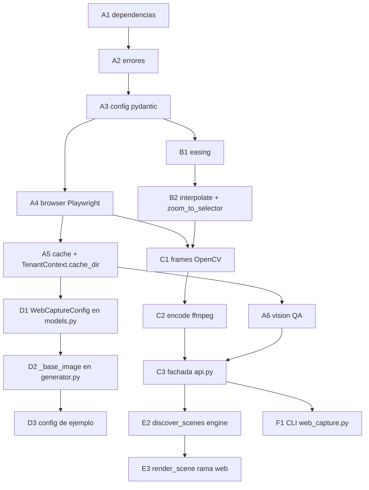

# Plan de acción — captura de URLs y cámara (zoom/pan) sobre screenshots

Estado objetivo: poder definir en un post o en un video un recurso
`type: "web"` que abre una URL, captura un screenshot HiDPI (viewport,
página completa, elemento o región), lo **valida con un modelo de visión
para descartar publicidad, banners, popups y otros artefactos**, y —cuando
el recurso es un video— anima un movimiento de cámara (zoom/pan) sobre esa
captura, generando los frames finales con OpenCV y codificándolos con ffmpeg.

Este documento describe **qué construir y en qué orden**, basado en la
arquitectura real del repo (no en supuestos). No implementa nada.

---

## 1. Diagnóstico

### 1.1 Arquitectura actual (relevada, no asumida)

El repo tiene **dos pipelines de contenido independientes**, ambos
tenant-aware vía `TenantContext`:

| Pipeline | Motor | Entrada | Salida |
|---|---|---|---|
| Posts/carruseles | Pillow (`src/noticia_carrusel/`) | YAML/JSON → `AppConfig` (Pydantic) | PNG por slide |
| Videos | Manim (`videos/<slug>/scene.py` por tenant) | Python (`Scene` subclases) + JSON de datos | MP4 vía `build.py` |

**Pipeline de posts** (`src/noticia_carrusel/`):

- `models.py`: `AppConfig`/`SlideConfig` (Pydantic). Cada slide resuelve
  su fondo de una de dos fuentes mutuamente excluyentes hoy:
  `background_image_path` (asset estático) o `image_generation`
  (`ImageGenerationConfig` → `OpenRouterImageProvider`, IA).
- `generator.py::_base_image()` es el punto único donde se decide el
  fondo de un slide y se cachea en `intermediate/base_NN.png`
  (`_intermediate_path()`), con `reuse_intermediate` para no volver a
  generar si ya existe (patrón documentado en `AGENTS.md` §8).
- `vision/image_ops.py` ya usa **OpenCV** (`smart_crop`, detección de
  rostro, `pil_to_bgr`/`bgr_to_pil`) — precedente directo para el
  motor de cámara.
- `providers/openrouter_image_provider.py` es el patrón a espejar para
  cualquier cliente externo nuevo: `XxxError(RuntimeError)`,
  `@dataclass(frozen=True)` de resultado, `__init__` valida config,
  método que hace el trabajo y nunca traga excepciones.
- `render/canvas.py::CanvasSpec.from_format()` resuelve `(width,
  height, safe_area)` por formato (`post_square`, `post_vertical`,
  `story`, `carousel_square`, `carousel_vertical`).

**Pipeline de video** (`build.py`):

- `discover_scenes()` recorre `videos_dir` del tenant, y por cada
  carpeta con `*.py` extrae clases `Scene` por regex
  (`extract_scene_classes`). Una carpeta = un video; no hay otro tipo
  de entrada reconocida hoy.
- `render_scene()` arma un comando `manim ...` y lo corre por
  `subprocess`, sea cual sea la escena.
- `combine_videos()` renderiza todas las escenas y las concatena con
  `ffmpeg -f concat -safe 0 -i list.txt -c copy` — **ya existe** un
  punto de unión por ffmpeg, no hay que inventarlo.
- `generate_post_summary()` genera el copy del post con PromptGate,
  atado a `scene["folder"]`/`scene["class"]` y a un JSON de datos.

**Multi-tenancy** (`tenant.py`): `TenantContext` centraliza toda
resolución de paths (`assets_dir`, `configs_dir`, `videos_dir`,
`media_dir`, `output_dir`, `content_dir`) con `resolve_inside()`
(bloquea path traversal) y `resolve_asset()` (prioridad tenant →
compartido). **No existe** una property de caché genérica hoy.
### 1.2 Lo que no existe y hace falta construir

| # | Hueco | Impacto |
|---|---|---|
| G1 | No hay cliente Playwright ni módulo de captura web | No se puede abrir una URL ni tomar screenshots |
| G2 | No hay motor de cámara (interpolación/easing) desacoplado de Manim | El pedido explícito es *no* usar Manim para esto |
| G3 | No hay generación de frames desde una imagen estática + timeline | Sin esto no hay zoom/pan animado |
| G4 | No hay encoder de frames → MP4 fuera de Manim | El pipeline actual solo produce MP4 vía render de Manim |
| G5 | `SlideConfig`/`AppConfig` no tienen una tercera fuente de fondo | El screenshot no puede ser el `background` de un post/slide |
| G6 | `build.py::discover_scenes()` solo reconoce carpetas con `scene.py` (Manim) | Una carpeta "video web" no se descubre ni se renderiza |
| G7 | `TenantContext` no tiene `cache_dir` | No hay dónde cachear screenshots fuera del patrón `intermediate/` (que es por-config, no por-URL) |
| G8 | No hay CLI de prueba aislada | No se puede validar el módulo sin pasar por posts/videos |
| G9 | **El repo no tiene suite de tests** (no hay `tests/`, ni pytest en dependencias) | Hay que fundar la infraestructura de tests, no solo agregar casos |
| G10 | `requirements.txt` no tiene `playwright` ni un mecanismo de dependencias de desarrollo | Hace falta agregar la dependencia y decidir dónde viven las de test |
| G11 | No hay validación automática de calidad del screenshot (publicidad, popups, cookie banners, paywalls, 404, captchas) | Un screenshot con un banner "GET 3 MONTHS PRINT & DIGITAL" (como el real de TIME) termina como fondo del post sin que nadie lo note hasta la revisión manual |

---

## 2. Decisiones de diseño (con justificación)

1. **Ubicación del módulo**: `src/noticia_carrusel/web_capture/`, no
   `media/web_capture.py` ni un `web_capture.py` suelto en la raíz. El
   repo ya tiene un patrón claro para "capacidad reutilizable
   tenant-aware": subpaquetes de `src/noticia_carrusel/` (`providers/`,
   `vision/`, `render/`). Un archivo suelto en la raíz rompería ese
   patrón sin necesidad.
2. **Desacople real de Manim**: el motor de cámara (easing +
   interpolación) se implementa **desde cero, sin importar `manim`**,
   aunque Manim ya tiene `rate_functions` con las mismas curvas
   (`linear`, `ease_in_sine`, etc.). Importar `manim` en
   `web_capture/` violaría el requisito explícito ("la captura web
   debe estar desacoplada del sistema de animación") y acoplaría un
   módulo pensado para usarse también fuera de video (posts estáticos)
   a una dependencia pesada (`manim>=0.21`, Cairo, LaTeX opcional). Las
   4 curvas (`linear`, `ease_in`, `ease_out`, `ease_in_out`) son
   fórmulas cúbicas de <10 líneas cada una: el costo de reescribirlas
   es menor que el costo de acoplar.
3. **Integración con posts**: nueva fuente de fondo `web_capture` en
   `SlideConfig`, resuelta en `_base_image()` exactamente como
   `image_generation` hoy (mismo contrato de retorno `(path,
   image_result, reused)`), cacheada con el mismo espíritu que
   `intermediate/` pero con clave propia (ver §3, Fase A). **Cero
   cambios** a slides existentes: campo nuevo, opcional, mutuamente
   excluyente con los otros dos.
4. **Integración con video**: en vez de crear un pipeline paralelo de
   "posts/videos web", se extiende `discover_scenes()` para reconocer
   una carpeta de video sin `scene.py` pero con `web.yaml` como un
   segundo **engine**. `render_scene()` branchea por engine; la salida
   sigue el mismo layout (`media/videos/<slug>/<hh>p<fps>/`) que ya
   consumen `--combine`, `--open` y `output_path_for()`. Así el clip
   web puede convivir y concatenarse con escenas Manim usando el
   `ffmpeg -f concat` que **ya existe**, sin tocar esa función.
5. **Performance**: un solo `Browser`/`BrowserContext` de Playwright
   reutilizado entre capturas (context manager), una sola captura de
   screenshot por recurso; todo el zoom/pan se calcula sobre esa imagen
   en memoria con OpenCV. Los frames se pipean a `ffmpeg` por stdin
   (`rawvideo`), no se escriben miles de PNG a disco.
6. **Caché**: nueva property `TenantContext.cache_dir` (mismo patrón
   que `content_dir`/`output_dir`), clave = hash de
   `(url, viewport, scale, selector, full_page, wait_for, delay)`.
   Sidecar `.json` con metadata para debug. `force_capture=True`
   invalida sin borrar el resto de la caché.
7. **Tests**: el repo no tiene suite hoy. Se funda con `pytest` +
   fixtures HTML locales servidas por un `http.server` en un puerto
   libre de `127.0.0.1` (sin red real, sin `file://` especial en el
   código de producción — ver §2.8).
8. **Seguridad** (prioridad del proyecto, ver `CLAUDE.md` global):
   `capture_url()` solo acepta esquemas `http://`/`https://` por
   defecto; `file://`, `javascript:`, `data:` quedan rechazados salvo
   flag explícito documentado como riesgo. Todo timeout es obligatorio
   (no hay espera indefinida). El error nunca se silencia: cada falla
   listada en el pedido original tiene una excepción propia con
   mensaje accionable.
9. **Validación visual con rol de visión (LLM)**: todo screenshot pasa
   por un chequeo automático de calidad antes de usarse como fondo.
   Un modelo de visión (rol `vision` de PromptGate / `OPENROUTER_VISION_MODEL`
   si PromptGate no expone visión) recibe la imagen en base64 y un
   prompt estructurado que pide clasificar si hay publicidad (banners,
   suscripciones, "SALE 50%", "GET 3 MONTHS"), popups/overlays, cookie
   banners, paywalls, 404/captchas, páginas en blanco o errores de
   render. La respuesta es JSON validado por Pydantic
   (`VisionCheckResult{clean: bool, issues: list[str], confidence: float}`).
   Si `clean==false`, el pipeline no usa la imagen tal cual: o bien
   rechaza con `ScreenshotRejectedError` (modo estricto, para video/post
   donde el fondo no puede tener ads), o bien reintenta la captura con
   mitigación (cerrar banner vía Playwright `locator.click()` con
   El chequeo es **opt-in por config** (`vision_check: bool = true` por
   defecto, `vision_check: false` lo salta) y su resultado se cachea en
   el sidecar JSON junto al screenshot para no pagar el costo de visión
   dos veces sobre la misma captura. Nunca silencia el error: si el
   proveedor de visión falla, se registra el warning y se deja pasar la
   imagen (fail-open con log), no se marca como limpia a ciegas.

---

## 3. Fases

### Fase A — Fundación del módulo (browser, config, errores, caché)

Sin dependencias externas de este plan; se puede construir primero.

#### A1. Dependencias

- **Target**: `requirements.txt`, `requirements-dev.txt` (nuevo).
- **Change**: agregar `playwright>=1.47` a `requirements.txt`
  (justificación: única forma de cumplir el requisito explícito de
  usar Playwright). Crear `requirements-dev.txt` con `pytest>=8.0`
  (el repo no tiene dependencias de desarrollo separadas hoy; se
  separan para no instalar pytest en producción). `opencv-python-headless`
  y `PyYAML` **ya están** en `requirements.txt` — no se agregan de
  nuevo.
- **Acceptance**: `uv pip install -r requirements.txt -r requirements-dev.txt`
  instala sin conflictos; `python -c "import playwright, pytest"` no falla.

#### A2. Errores del módulo

- **Target**: `src/noticia_carrusel/web_capture/errors.py` (nuevo).
- **Change**: `WebCaptureError(RuntimeError)` base y subclases:
  `InvalidUrlError`, `CaptureTimeoutError`, `SelectorNotFoundError`,
  `SelectorHiddenError`, `BrowserNotInstalledError`, `ScreenshotError`,
  `RegionTooSmallError`, `EncodeError`, **`ScreenshotRejectedError`**
  (nuevo para A6: el chequeo de visión rechazó la imagen por
  publicidad/artefactos; mensaje incluye los `issues` detectados).
  Cada una con mensaje que incluye la URL/selector/comando relevante —
  mismo estándar que `ImageProviderError`.
- **Acceptance**: cada excepción es instanciable con un mensaje
  descriptivo; ninguna hereda de `Exception` genérica pelada.

#### A3. Configuración (Pydantic)

- **Target**: `src/noticia_carrusel/web_capture/models.py` (nuevo).
- **Change**:
  - `CaptureConfig`: `url: str`, `viewport: tuple[int, int] = (1920,
    1080)`, `scale: int = 2` (`device_scale_factor`), `full_page: bool
    = False`, `selector: str | None = None`, `wait_for_selector: str |
    None = None`, `wait_for_network_idle: bool = False`, `delay_ms: int
    = 0`, **`vision_check: bool = True`, `strict_vision: bool = False`**
    (A6: si `vision_check` es `False` se salta el chequeo de visión por
    completo; `strict_vision=True` hace que un `clean==false` lance
    `ScreenshotRejectedError` en vez de reintentar/loguear). Validador:
    `url` debe empezar con `http://`/`https://`.
  - `VisionCheckResult(BaseModel)` (A6): `clean: bool`, `issues:
    list[str]`, `confidence: float`, `raw_response: str | None`.
  - `CameraKeyframe`: `time: float`, `x: float = 0.5`, `y: float =
    0.5`, `zoom: float = 1.0`, `easing: Literal["linear","ease_in",
    "ease_out","ease_in_out"] = "ease_in_out"` (easing aplica al tramo
    que **termina** en este keyframe). Validadores: `0 <= x,y <= 1`,
    `zoom >= 1.0`.
  - `CameraTimeline`: `keyframes: list[CameraKeyframe]` (mínimo 1,
    ordenados por `time` sin duplicados).
  - `WebSceneConfig` (para integrar con video, Fase E):
    `capture: CaptureConfig`, `duration: float`, `fps: int = 30`,
    `camera: CameraTimeline | None = None`, `zoom_to: str | None =
    None` (selector; mutuamente excluyente con `camera`), `padding:
    float = 0.15`.
- **Acceptance**: una `CaptureConfig(url="ftp://x")` lanza
  `ValidationError`; un `CameraTimeline` con dos keyframes en el mismo
  `time` lanza error; `WebSceneConfig` con `camera` y `zoom_to` a la
  vez lanza error. `CaptureConfig(vision_check=False)` se valida aunque
  no haya modelo de visión configurado.
  `time` lanza error; `WebSceneConfig` con `camera` y `zoom_to` a la
  vez lanza error.

#### A4. Cliente Playwright

- **Target**: `src/noticia_carrusel/web_capture/browser.py` (nuevo).
- **Change**:
  - `class BrowserManager`: context manager (`__enter__`/`__exit__`)
    que lanza **un** `chromium` (Playwright sync API) y lo mantiene
    vivo entre llamadas; `new_page(viewport, scale)` crea una page por
    captura. Si Chromium no está instalado, capturar la excepción de
    Playwright y relanzar `BrowserNotInstalledError` con el mensaje
    `playwright install chromium`.
  - `capture_url(cfg: CaptureConfig, manager: BrowserManager | None =
    None) -> CaptureResult`: si no se pasa `manager`, abre uno
    temporal (para uso simple/CLI); si se pasa, lo reutiliza (para uso
    batch, Fase E). Aplica `wait_for_selector`/`wait_for_load_state
    ("networkidle")`/`delay_ms` según config, con **timeout explícito**
    (nuevo parámetro `timeout_ms`, default 30000) que traduce
    `TimeoutError` de Playwright a `CaptureTimeoutError`. Devuelve
    `CaptureResult(image: PIL.Image, bounds: tuple|None)` — si hay
    `selector`, captura con `element_handle.screenshot()` tras
    `wait_for_selector(state="visible")` (si está oculto,
    `SelectorHiddenError`; si no existe tras el timeout,
    `SelectorNotFoundError`); si no, `page.screenshot(full_page=...)`.
  - `get_element_bounds(url: str, selector: str, manager=None) ->
    dict`: navega, resuelve `element_handle.bounding_box()`, devuelve
    `{"x", "y", "width", "height"}` en píxeles de página (no de
    viewport escalado). Mismos errores que arriba si falta/oculto.
- **Acceptance**: contra un fixture HTML local con un `<div
  id="grafico">` de tamaño conocido por CSS, `get_element_bounds`
  devuelve el tamaño esperado ±1px; un selector inexistente lanza
  `SelectorNotFoundError` con el nombre del selector en el mensaje.

#### A5. Caché de capturas

- **Target**: `src/noticia_carrusel/tenant.py`, `web_capture/cache.py` (nuevo).
- **Change**: agregar `TenantContext.cache_dir` (`self.root /
  "cache"`) y `cache_path(*relative)` (usa `resolve_inside`, mismo
  patrón que `content_path`). En `web_capture/cache.py`:
  `cache_key(cfg: CaptureConfig) -> str` (sha256 de los campos
  relevantes, primeros 16 hex), `cached_path(tenant, cfg) -> Path`
  (`tenant.cache_dir / "web_capture" / f"{key}.png"`), `load_cached`/
  `store_cached` con sidecar `.json` (url, selector, timestamp).
  `force_capture: bool` en la API pública (Fase C) ignora el hit y
  regenera, pero sigue escribiendo el nuevo resultado en la misma
  clave.
- **Change adicional**: `.gitignore` → agregar `tenants/*/cache/`.
- **Acceptance**: dos llamadas consecutivas con la misma `CaptureConfig`
  usan el archivo cacheado (no navegan de nuevo — verificable con un
  contador de llamadas mockeado en test); `force_capture=True` navega
  igual aunque exista caché.

#### A6. Validación visual del screenshot con rol de visión (LLM)

- **Target**: `src/noticia_carrusel/web_capture/vision.py` (nuevo),
  `src/noticia_carrusel/web_capture/errors.py`, `web_capture/models.py`,
  `web_capture/cache.py`.
- **Change**:
  - Nuevo `ScreenshotRejectedError(WebCaptureError)` en `errors.py` para
    el caso en que el chequeo de visión rechaza la imagen (modo estricto).
  - Nuevo `VisionCheckResult(BaseModel)` (`clean: bool`, `issues:
    list[str]`, `confidence: float`, `raw_response: str | None`) y campo
    `vision_check: bool = True` en `CaptureConfig` / `WebCaptureConfig`
    (si es `False`, se salta el chequeo por completo; útil para fixtures
    locales o para no pagar el costo de visión en iteraciones rápidas).
  - Nuevo `vision.py`: `check_screenshot(image: PIL.Image | Path,
    prompt_version: str = "v1") -> VisionCheckResult`. Codifica la imagen
    a base64 (JPEG 85, máximo 1920px en el lado largo y solicitud
    `detail=high`) para conservar texto legible. El frame se centra sin
    escalar dentro de un lienzo cuadrado y se delimita con un borde blanco;
    esto evita el recorte interno que algunos proveedores aplican a piezas
    9:16 y da al modelo evidencia explícita del límite real. La envía al rol
    de visión (preferencia: `PROMPTGATE_VISION_MODEL` si PromptGate expone
    visión; fallback `OPENROUTER_VISION_MODEL`, default
    `google/gemini-2.5-flash`). El prompt revisa publicidad/overlays, errores
    de carga, texto cortado, contraste, solapamientos, zonas seguras, logos
    falsos y objetos focales tapados. Exige glifos contra el borde antes de
    declarar recorte y distingue texto estático de una transición.
  - La respuesta se parsea con `json.loads` y validación Pydantic. Si no hay
    proveedor o la llamada falla, la primitiva devuelve `clean=True` con
    `confidence=0.0`; un gate obligatorio debe tratar esa confianza como
    proveedor no disponible y nunca registrar el artefacto como aprobado.
  - Integración: `api._capture_cached` y `browser.capture_url` llaman a
    `vision.check_screenshot` inmediatamente después de obtener
    `CaptureResult.image` y **antes** de `store_cached`. El resultado se
    guarda en el sidecar JSON (`"vision": {...}`) para no repetir el
    costo (ver Fase A5). Si `clean==false` y `vision_check` está activo:
    en modo estricto (`strict_vision: bool = True` en `CaptureConfig`,
    default `False` para no romper flujos existentes) lanza
    `ScreenshotRejectedError` con los `issues`; en modo blando (default)
    reintenta **hasta 3 veces** con mitigación Playwright (cerrar cookie
    banners: `page.locator("text=Accept|Got it|Close|Aceptar").first.click(timeout=2000)` ignorando fallo, y/o `page.add_style_tag` para ocultar selectores `[id*="ad" i]` si hace falta) y vuelve a
    chequear; si a la **4ta evaluación** sigue sucio, se detiene el loop,
    se loguea `error` con los `issues` y se devuelve la última imagen
    igual (fail-open) pero con `VisionCheckResult` adjunto para que el
    llamador (`generator.py`, `build.py`) decida e informe al usuario que
    no pasó validación tras 3 reintentos.
  - Costo: se registra como `VisionCheckResult` en el sidecar, no como
    `CostEntry` de imagen; si el proveedor informa costo, se loguea pero
    no bloquea. El chequeo se salta automáticamente si la imagen viene
    de caché y el sidecar ya tiene `"vision"` válido.
- **Acceptance**: un screenshot real de TIME con el banner superior
  "GET 3 MONTHS PRINT & DIGITAL. SAVE 50%" es clasificado `clean=false`
  con `issues` conteniendo "publicidad" o "banner"; un fixture limpio
  `simple.html` es `clean=true`. Test mockeado que simula respuesta
  del LLM sin red pasa en ambos casos.

---

### Fase B — Motor de cámara (puro, sin I/O)

Depende de A3 (modelos). No depende de Playwright/OpenCV: es solo
matemática, 100% testeable sin fixtures.

#### B1. Easing

- **Target**: `src/noticia_carrusel/web_capture/easing.py` (nuevo).
- **Change**: `linear(t)`, `ease_in(t)` (`t**2`), `ease_out(t)`
  (`1-(1-t)**2`), `ease_in_out(t)` (cúbica clásica: `4*t**3` si
  `t<0.5` sino `1-(-2*t+2)**3/2`). Todas `t: float en [0,1] -> float en
  [0,1]`. `EASING_FUNCS: dict[str, Callable]` para lookup desde
  `CameraKeyframe.easing`.
- **Acceptance**: cada función devuelve `0.0` en `t=0` y `1.0` en
  `t=1`; `ease_in(0.5) < 0.5 < ease_out(0.5)`.

#### B2. Interpolación y zoom automático

- **Target**: `src/noticia_carrusel/web_capture/camera.py` (nuevo).
- **Change**:
  - `interpolate(timeline: CameraTimeline, t: float) -> CameraState`
    (`CameraState = x, y, zoom`, dataclass): ubica el segmento
    `[k_i, k_{i+1}]` que contiene `t`, aplica el easing del keyframe
    destino sobre `t` normalizado al segmento, interpola linealmente
    `x`, `y`, `zoom` con el valor easeado. `t` antes del primer
    keyframe o después del último clampea a los extremos.
  - `zoom_to_selector(bounds: dict, image_size: tuple[int,int],
    padding: float = 0.15) -> CameraKeyframe`: calcula centro
    normalizado (`(x+w/2)/W`, `(y+h/2)/H`) y `zoom` tal que la región
    del elemento + padding ocupe el frame completo
    (`zoom = min(W/(w*(1+2*padding)), H/(h*(1+2*padding)))`, con piso
    `zoom >= 1.0`). Si `w` o `h` es 0 o el `zoom` resultante requeriría
    una región menor a un mínimo de nitidez (`MIN_CROP_PX = 64`),
    lanza `RegionTooSmallError`.
  - `build_zoom_to_timeline(bounds, image_size, duration, padding) ->
    CameraTimeline`: keyframe inicial `(t=0, x=0.5, y=0.5, zoom=1.0,
    ease_in_out)` + keyframe final `zoom_to_selector(...)` en
    `t=duration`. Es la implementación de `zoom_to_selector(selector,
    duration, padding)` del pedido (la resolución de `selector`→
    `bounds` vive en la fachada de Fase C, que sí tiene Playwright).
- **Acceptance**: `interpolate` en el punto medio de dos keyframes con
  `easing="linear"` da el promedio exacto; con `ease_in` da un valor
  más cercano al keyframe inicial. `zoom_to_selector` sobre un
  elemento que ocupa 1/4 del ancho de imagen da `zoom ≈ 4/(1+2*0.15)`.
  Un `bounds` con `width=0` lanza `RegionTooSmallError`.

---

### Fase C — Frames (OpenCV) y encoding (FFmpeg)

Depende de A (screenshot) y B (timeline). Es el núcleo pedido como
"especialmente importante".

#### C1. Generación de frames

- **Target**: `src/noticia_carrusel/web_capture/frames.py` (nuevo).
- **Change**: `iter_frames(image: PIL.Image, timeline: CameraTimeline,
  duration: float, fps: int, output_size: tuple[int,int]) ->
  Iterator[np.ndarray]` (BGR, listo para ffmpeg). Por cada frame `i`:
  `t = i/fps`; `state = interpolate(timeline, t)`; calcula el
  rectángulo de crop en la imagen fuente a partir de `(state.x,
  state.y, state.zoom, output_size)` — centro en `(x*W, y*H)`, tamaño
  `(output_w/zoom, output_h/zoom)` clamp a los bordes de la imagen
  fuente (nunca sale del frame, se re-centra si el crop tocaría un
  borde); recorta con `cv2` (slicing, no hay rotación) y resize a
  `output_size` con `cv2.INTER_LANCZOS4` (upscaling de calidad en
  zooms altos). Reusa `pil_to_bgr` de `vision/image_ops.py` para la
  conversión inicial — no reimplementa esa utilidad.
  Si el crop resultante en píxeles de la imagen fuente es menor a
  `MIN_CROP_PX` en algún eje, `RegionTooSmallError` (protege contra
  pedir un zoom mayor al que la resolución de captura soporta).
- **Acceptance**: con `zoom` constante en `1.0`, todos los frames son
  bit-idénticos (mismo crop = imagen completa reescalada); con `zoom`
  creciente en el timeline, el ancho del rectángulo de crop decrece
  monótonamente frame a frame.

#### C2. Encoding a MP4

- **Target**: `src/noticia_carrusel/web_capture/encode.py` (nuevo).
- **Change**: `encode_frames_to_mp4(frames: Iterator[np.ndarray],
  output_path: Path, fps: int, size: tuple[int,int]) -> Path`. Arma un
  subprocess `ffmpeg -y -f rawvideo -pix_fmt bgr24 -s WxH -r FPS -i -
  -c:v libx264 -pix_fmt yuv420p -movflags +faststart output.mp4`,
  escribe cada frame a `proc.stdin` (evita materializar miles de PNG),
  cierra stdin y espera. Mismo manejo de errores que `build.py`:
  `FileNotFoundError` → mensaje "ffmpeg no encontrado, instalá con
  brew install ffmpeg"; `returncode != 0` → `EncodeError` con el
  stderr de ffmpeg incluido (no se silencia).
- **Acceptance**: dado un iterable de 10 frames sintéticos
  (`np.zeros`), produce un MP4 real de 10/`fps` segundos, verificable
  con `ffprobe` (duración y resolución esperadas).

#### C3. Fachada pública

- **Target**: `src/noticia_carrusel/web_capture/api.py` (nuevo).
- **Change**: reexporta la API mínima pedida, ya con caché (Fase A5)
  aplicada:
  - `capture_url(url, width=1920, height=1080, scale=2, selector=None,
    full_page=False, wait_for_selector=None, wait_for_network_idle=False,
    delay_ms=0, tenant=None, force_capture=False) -> Path` (PNG en
    caché o recién capturado).
  - `get_element_bounds(url, selector, tenant=None) -> dict`.
  - `render_web_clip(scene: WebSceneConfig, output_path: Path, tenant=None,
    force_capture=False) -> Path`: 1) `capture_url` una vez (resolución
    HiDPI, mayor a la de salida — ver §4); 2) si `zoom_to` está
    seteado, resuelve `get_element_bounds` + `build_zoom_to_timeline`;
    si `camera` está seteado, lo usa directo; 3) `iter_frames` +
    `encode_frames_to_mp4`. Esta función es el punto de entrada único
    que usan tanto la Fase D (posts, sin cámara) como la Fase E
    (video, con cámara) y el CLI (Fase F).
- **Acceptance**: `render_web_clip` sobre un fixture local con
  `zoom_to="#grafico"` produce un MP4 cuyo primer frame es la vista
  completa y cuyo último frame, recortado, contiene solo la región del
  elemento (verificable comparando histogramas o dimensiones de crop
  esperadas en el test).

---

### Fase D — Integración con posts/carruseles (Pillow)

Depende solo de A (no necesita cámara/frames/encode: un post es un
frame único). Entrega valor con el menor riesgo.

#### D1. Config

- **Target**: `src/noticia_carrusel/models.py`.
- **Change**: agregar `WebCaptureConfig` (reexport de
  `web_capture.models.CaptureConfig` más `padding: float = 0.0` para
  permitir recorte alrededor de un `selector` sin cámara) como campo
  opcional `web_capture: WebCaptureConfig | None = None` en
  `SlideConfig`. `model_validator` en `SlideConfig`: a lo sumo **uno**
  de `background_image_path` / `image_generation.enabled` /
  `web_capture` puede estar activo por slide.
- **Acceptance**: una config con `web_capture` y
  `image_generation.enabled: true` simultáneos falla la validación con
  mensaje claro.

#### D2. Resolución en el generador

- **Target**: `src/noticia_carrusel/generator.py`.
- **Change**: en `_base_image()`, nueva rama antes del `if
  image_config.enabled`: si `slide.web_capture` está seteado, llamar
  `_web_capture_path()` (nuevo helper, mismo patrón que
  `_intermediate_path` pero delega en
  `web_capture.api.capture_url(..., tenant=tenant,
  force_capture=not reuse_intermediate)`) y devolver `(path, None,
  reused)`. Sin costo asociado (no toca `CostEntry`). El resultado se
  recorta a `CanvasSpec.from_format(config.format)` con `smart_crop`
  existente si el screenshot no calza el aspect ratio del post — reuso
  directo de `vision/image_ops.py`, cero código nuevo ahí.
- **Acceptance**: una config `post_vertical.yaml` con
  `slides[0].web_capture.url` genera `slide_01.png` con el screenshot
  como fondo y el texto/branding compuesto encima, igual que con
  `image_generation` hoy. Ejecutar dos veces con `reuse_intermediate` da
  el mismo PNG sin re-navegar (verificable con el mismo mecanismo de
  A5).

#### D3. Config de ejemplo

- **Target**: `tenants/agente32/configs/images/post_web_capture.yaml` (nuevo).
- **Change**: post vertical con un slide `web_capture` apuntando a una
  URL pública estable (documentar cuál y por qué es estable, p. ej. una
  página de documentación versionada) — análogo a los ejemplos
  existentes que declaran explícitamente cuándo consumen red/costo.
- **Acceptance**: `python scripts/generate_images.py post --config
  post_web_capture.yaml` produce un PNG válido.

---

### Fase E — Integración con video (`build.py`)

Depende de C (clip MP4) y de la convención de carpeta de Fase A.
Es el cambio de mayor superficie sobre código existente — acotarlo al
mínimo indispensable.

#### E1. Convención de carpeta

- **Target**: documentado en `docs/web-capture.md` (Fase H), sin código
  propio.
- **Change**: una carpeta de video puede tener `scene.py` (Manim,
  existente) o `web.yaml` (nuevo, sin `scene.py`) validado contra
  `WebSceneConfig` (Fase A3). Ambas conviven en `videos/` del tenant;
  `--combine` puede mezclar clips de los dos orígenes.

#### E2. Discovery

- **Target**: `build.py::discover_scenes()`.
- **Change**: por carpeta, si hay `*.py` con clases `Scene` → entradas
  `engine="manim"` (comportamiento actual, sin cambios). Si además (o
  en cambio) hay `web.yaml`/`web.yml` → una entrada adicional
  `{"engine": "web", "folder": ..., "class": "<slug al título>",
  "path": <path a web.yaml>}`. Una carpeta puede aportar ambos tipos de
  entrada si en el futuro hace falta (no es el caso hoy).
- **Acceptance**: `build.py --list` sobre una carpeta con solo
  `web.yaml` la lista igual que hoy lista carpetas con `scene.py`, sin
  romper el listado de las carpetas Manim existentes.

#### E3. Render

- **Target**: `build.py::render_scene()`.
- **Change**: branch al principio por `scene["engine"]`. Rama
  `"manim"`: código actual, sin tocar. Rama `"web"`: importa
  `src.noticia_carrusel.web_capture.api.render_web_clip` (import
  perezoso, dentro de la función, para no acoplar `build.py` a
  Playwright cuando no hace falta), carga `WebSceneConfig` desde
  `web.yaml`, mapea `fmt`/`quality` a un `(width, height, fps)` de
  salida con la misma tabla `FORMATS`/`QUALITY_FLAGS` que ya usa la
  rama Manim, llama `render_web_clip(...)`, guarda en
  `output_path_for(scene, quality, fmt)` (misma función, sin cambios)
  para que `--combine`/`--open`/`trim_audio_to_video` (no-op si no hay
  audio) sigan funcionando. Mismo manejo de errores: capturar
  `WebCaptureError` y las subclases de Fase A2, imprimir mensaje claro,
  devolver `False` (mismo contrato que el `except
  subprocess.CalledProcessError` de la rama Manim).
- **Acceptance**: `python build.py --video <slug-web>` produce un MP4
  en el mismo layout que un video Manim; `python build.py --combine`
  con una escena Manim y una escena web en el tenant produce un único
  MP4 concatenado sin cambios en `combine_videos()`.

#### E4. Alcance explícitamente fuera de esta fase

- `generate_post_summary()` no se extiende todavía para escenas web
  (hoy asume un JSON de datos tipo `lostops`). Documentar como
  pendiente; no bloquea el resto. Evita inflar el alcance sin un caso
  de uso concreto.

---

### Fase F — CLI de prueba

Depende de C (screenshot + clip) y D/E solo conceptualmente (el CLI no
importa `build.py` ni `generator.py`, solo `web_capture.api`).

#### F1. `scripts/web_capture.py`

- **Target**: archivo nuevo, mismo patrón que `scripts/fetch_logo.py`
  (`argparse`, sin dependencia de tenant salvo para caché opcional).
- **Change**: flags `--url` (requerido), `--output` (PNG, modo
  screenshot), `--selector`, `--width`/`--height`/`--scale`,
  `--full-page`, `--wait-for-selector`, `--delay`, `--bounds` (imprime
  el JSON de `get_element_bounds` y termina), `--zoom-to` + `--duration`
  + `--video` (modo clip), `--tenant` (opcional, solo para resolver
  caché), `--force-capture`. Sin `--video`, solo captura PNG; con
  `--video`, arma un `WebSceneConfig` mínimo y llama
  `render_web_clip`.
- **Acceptance**: los tres comandos del pedido original
  (`--url --output`, `--url --selector --output`, `--url --zoom-to
  --duration --video`) funcionan tal cual están escritos en el
  enunciado.

---

## 4. Resolución de captura vs. salida

`capture_url` recibe `width`/`height`/`scale` **de la captura**
(viewport × `device_scale_factor`), independiente de la resolución de
salida del post/video. `render_web_clip` fija por defecto
`scale=2` sobre el viewport de salida (p. ej. salida 1080×1920 →
captura en viewport 1080×1920 con `scale=2` ⇒ screenshot físico
2160×3840), suficiente para zooms de hasta ~2x sin degradar. Si
`WebSceneConfig.camera`/`zoom_to` implica un zoom mayor, `capture_url`
recibe `scale` ajustado (`ceil(zoom_max / 2) * 2`, con techo
configurable) para no perder nitidez, sin disparar por defecto a
tamaños arbitrarios (pedido explícito: "no generar imágenes enormes
sin necesidad").

---

## 5. Orden de ejecución



`D` y `E` son independientes entre sí (ambas dependen de `A`/`C` pero
no una de la otra) — pueden ir en paralelo una vez cerrada `C3`. `A6`
bloquea `C3` (la fachada no puede devolver una imagen sin haber pasado
por el chequeo de visión).

---

## 6. Tests

El repo no tiene suite hoy: esta fase también funda la infraestructura.

| Target | Cubre | Depende de |
|---|---|---|
| `requirements-dev.txt` + `pyproject.toml [tool.pytest.ini_options]` (`testpaths=["tests"]`) | Infra de tests | — |
| `tests/web_capture/conftest.py`: fixture `local_server` (`http.server.ThreadingHTTPServer` en `127.0.0.1:<puerto libre>`, sirve `tests/web_capture/fixtures/`) | Toda captura real, sin red | A1 |
| `tests/web_capture/fixtures/*.html`: `simple.html`, `with_element.html` (`#grafico` con `width`/`height` fijos por CSS), `hidden_element.html` (`display:none`), `slow_dynamic.html` (elemento inyectado tras `setTimeout`) | Casos DOM del pedido | — |
| `test_easing.py` | curvas en `t=0`/`t=1`/monotonía | B1 |
| `test_camera.py` | interpolación entre keyframes, `zoom_to_selector`, `RegionTooSmallError` | B2 |
| `test_frames.py` | tamaño/aspect de frame generado, crop monótono con zoom creciente, sin red ni Playwright (imagen sintética `np.zeros`) | C1 |
| `test_encode.py` | MP4 real de N frames sintéticos, duración/resolución vía `ffprobe` | C2 |
| `test_capture_url.py` | screenshot simple y full-page contra `local_server` | A4 |
| `test_capture_element.py` | selector visible, dimensiones ≈ CSS declarado | A4 |
| `test_bounds.py` | `get_element_bounds` devuelve `x/y/width/height` esperados | A4 |
| `test_selector_errors.py` | `SelectorNotFoundError`, `SelectorHiddenError` (fixtures dedicados) | A4 |
| `test_cache.py` | segunda captura con misma config no vuelve a navegar; `force_capture` sí | A5 |
| `test_vision.py` | `VisionCheckResult` parsing, `clean=false` con banner simulado, `clean=true` con fixture limpio, `strict_vision` lanza `ScreenshotRejectedError`, `vision_check=False` salta el chequeo, caché evita segundo llamado al LLM (mock) | A6 |
| `test_vision_integration.py` | screenshot real de TIME mockeado con banner detectado y reintento con mitigación (mock Playwright + mock visión) | A6 + C3 |
| `test_slide_web_capture.py` | `_base_image` resuelve un slide `web_capture` y cachea igual que `image_generation` | D2 |

Los tests que requieren Chromium (`test_capture_*`, `test_bounds`,
`test_selector_errors`) se marcan `@pytest.mark.playwright` y se
saltan con mensaje explícito (`pytest.skip`, no `xfail` silencioso) si
`playwright install chromium` no corrió — no deben romper `pytest`
en un checkout limpio sin el browser instalado. Los tests de visión que
requieren LLM se marcan `@pytest.mark.vision` y se mockean por defecto
(sin costo/red); solo con `OPENROUTER_VISION_MODEL` + credenciales reales
corren contra el proveedor (opt-in).

---

## 7. Documentación

| Archivo | Contenido |
|---|---|
| `docs/web-capture.md` (nuevo) | Arquitectura (diagrama del pedido + paso de visión), instalación (`playwright install chromium` + modelos de visión `OPENROUTER_VISION_MODEL` / `PROMPTGATE_VISION_MODEL`), los 7 ejemplos pedidos (screenshot simple, full page, elemento, zoom manual, zoom automático a selector, pan+zoom, integración en post/video), tabla de errores con causa y remedio (incluye `ScreenshotRejectedError` y cómo desactivar el chequeo con `vision_check: false`), sección específica de validación visual (qué detecta, modo estricto vs. blando, reintento con mitigación, caché del resultado) |
| `README.md` | Nueva sección breve bajo "Generador de placas y carruseles" con mención de `web_capture`, instalación de Playwright, link a `docs/web-capture.md` |
| `tenants/agente32/videos/*/README.md` o nuevo `videos/<slug-web>/README.md` | Ejemplo concreto de `web.yaml` documentado igual que `lostops/README.md` |

---

## 8. Prioridad

| Prioridad | Fases | Razón |
|---|---|---|
| P0 | A (A1-A5) | Sin fundación no hay nada que integrar |
| P0.5 | A6 (visión) | Sin esto, un banner "SAVE 50%" llega a producción sin filtro; es el requisito nuevo explícito del usuario |
| P1 | B, C | El motor de cámara + frames + encode es el corazón explícito del pedido ("especialmente importante") |
| P1 | D | Menor riesgo, mayor reuso, entrega valor rápido (screenshot estático en un post) |
| P2 | E | Mayor superficie de cambio sobre `build.py`; requiere C completo |
| P2 | F | Habilita probar A–E de forma aislada; en paralelo a D/E una vez C está listo |
| Transversal | Tests (§6) | Se escriben **junto con cada fase**, no al final — cada fase cierra con su propio test, igual que el resto del repo |
| P3 | Documentación (§7) | Se consolida al cierre, con notas incrementales por fase |

---

## 9. Riesgos

| Riesgo | Mitigación |
|---|---|
| Chromium (~300 MB) infla el entorno de un repo hoy liviano | Instalación explícita y documentada (`playwright install chromium`), nunca automática en `requirements.txt` |
| SSRF / lectura de archivos locales vía `file://` si la URL viene de una fuente no confiable | `capture_url` rechaza esquemas distintos de `http`/`https` por defecto |
| Screenshots full-page de sitios muy largos consumen memoria en el paso de frames | Frames se pipean a ffmpeg por stdin, no se acumulan todos en RAM; `MIN_CROP_PX` evita zooms que exigirían upscaling extremo |
| `build.py::discover_scenes()`/`render_scene()` es código que funciona hoy | Cambios aditivos: rama `"manim"` sin tocar, import de Playwright perezoso dentro de la rama `"web"` para que el resto de `build.py` no dependa de Playwright |
| Suite de tests nueva podría bloquear CI/checkout sin Chromium | Tests que requieren browser real se saltan con mensaje explícito si no está instalado; los tests de `easing`/`camera`/`frames` no dependen de Playwright en absoluto |
| Posts/slides existentes rompen validación al agregar un campo nuevo | `web_capture` es opcional (`None` por defecto); configs sin el campo no cambian de comportamiento |
| Falsos positivos/negativos del modelo de visión (marca limpio un ad, o rechaza una página limpia) | Prompt explícito + validación Pydantic + revisión de `confidence`; un gate obligatorio no acepta `confidence=0.0`; resultado cacheado para auditar |
| Costo/latencia del LLM de visión por cada screenshot | Imagen limitada a 1920px, JPEG 85 y marco diagnóstico cuadrado para preservar el frame completo; resultado cacheado en sidecar y `vision_check: false` queda reservado para fixtures o flujos no obligatorios |

---

## 10. Verificación de cierre

Al completar todas las fases, prueba de extremo a extremo con el caso
del enunciado:

```python
web_scene(url="https://example.com", duration=5, zoom_to="#grafico")
```

equivalente real en este plan:

```yaml
# videos/2026-0X-XX_ejemplo-web/web.yaml
capture:
  url: "https://example.com"
duration: 5
zoom_to: "#grafico"
```

```bash
python build.py --video ejemplo-web --no-preview
```

debe producir un MP4 en `media/videos/.../` que arranca en la vista
completa y termina con `#grafico` centrado y ampliado, sin haber
tocado ninguna escena Manim existente.
